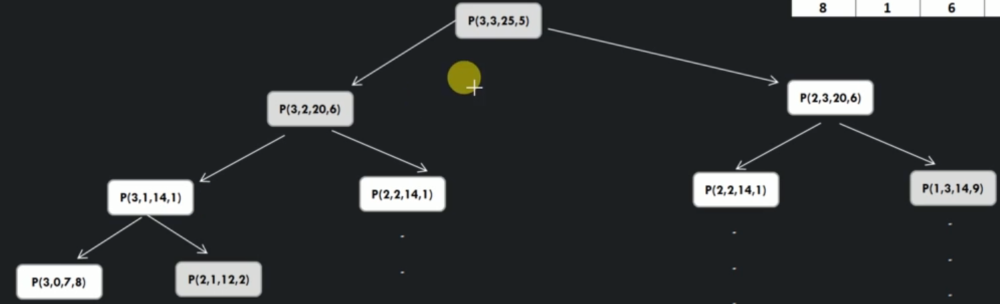

# Number of paths to last cell given cost


```
int numberOfPaths(int array[][], int row, int cost)
    if(cost < 0)
        return 0
    if row == 0 && col == 0
        return array[0][0] - cost == 0 ? 1 : 0
    if row == 0 // at first row, we can only go left
        return NumberOfPaths(array, 0, col - 1, cost - array[row][col])
    if col == 0
        return NumberOfPaths(array, row - 1, 0, cost - array[row][col])

    int noOfPathsFromPreviousRow = numberOfPaths(array, row - 1, col, cost - array[row][col])
    int noOfPathsFromPreviousCol = numberOfPaths(array, row, col - 1, cost - array[row][col])

    return noOfPathsFromPreviousRow + noOfPathsFromPreviousCol
```




## Top Down approach

```
int numberOfPathsAux(int dp[][], int array[][], int row, int col, int cost)

    if cost < 0
        return 0

    if row == 0 && col == 0
        return (array[0][0] - cost == 0) ? 1 : 0

    if dp[row][col] == 0

        if row == 0
            dp[row][col] = numberOfPaths(array, 0, col - 1, cost - array[row][ col])
        else if (col == 0)
            dp[row][col] = numberOfPaths(array, row - 1, 0, cost - array[row][col])
        else
            int noOfPathsFromPreviousRow = numberOfPaths(array, row - 1, col, cost - array[row][col])
            int noOfPathsFromPreviousCol = numberOfPaths(array, row, col - 1, cost - array[row][col])

            dp[row][col] = noOfPathsFromPreviousRow + noOfPathsFrompreviousCol

    return dp[row][col]

```

## Bottom up approach

```

NumberOfPathsToReachLastCell(arr,cost)

    for int row = numberOfRow - 2; row >= 0; row --
        for int col = numberOfCol - 2; col >= 0; col --

            NumberOfPathsNode tmp = new NumberOfPathsNode(array[row][col], dp[row][col+1], dp[row+1][col] costToReachLastCell)

            tmp.calculateNumberOfWaysSatisfyinfRightCell()
            tmp.calculateNumberOfWaysSatisfyinfDownCell()
            tmp.setNumberOfWaysToComeHereFromRightOrDown()
    
    dp[row][col] = tmp
    print dp[0][0]

```