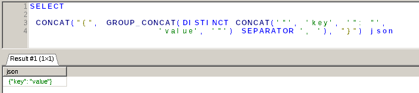

# JSONOBJECTAGG() alternative in MariaDB

While the function is supported in MySQL, it is not in MariaDB. The workaround is to use something like this:

```sql
SELECT
 CONCAT("{", GROUP_CONCAT(DISTINCT CONCAT('"', 'key', '": "',
                      'value', '"') SEPARATOR ', '), "}") json
```


