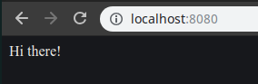

# Unnecessary rebuilds

When starting the server:

```
davis@davis-arch  ~/projects/docker/02_nodejs_web_server   master ●  docker run -p 8080:8080 daviskregers/simpleweb

> @ start /usr/app
> node index.js

Listening on port 8080
```

And changing the `index.js` file:

```js
const express = require('express');
const app = express();
app.get('/', (req, res) => {
    res.send('Hello there!');
});
app.listen(8080, () => {
    console.log('Listening on port 8080');
} );
```

When we refresh the page, we will still see the old text: 



The change is not automatically reflected in the container, in order to see it, we will have to rebuild the image.

Also, when rebuilding the application we can see:

```
davis@davis-arch  ~/projects/docker/02_nodejs_web_server   master ●  docker build -t daviskregers/simpleweb .        
Sending build context to Docker daemon  4.096kB
Step 1/5 : FROM node:alpine
 ---> ebbf98230a82
Step 2/5 : WORKDIR /usr/app
 ---> Using cache
 ---> 81d0968ef0fb
Step 3/5 : COPY ./ ./
 ---> 8ad383e24c1f
Step 4/5 : RUN npm install
 ---> Running in 73dee9dfef3a
npm notice created a lockfile as package-lock.json. You should commit this file.
npm WARN app No description
npm WARN app No repository field.
npm WARN app No license field.

added 48 packages from 36 contributors and audited 121 packages in 2.103s
found 0 vulnerabilities

Removing intermediate container 73dee9dfef3a
 ---> ecb7066fcd67
Step 5/5 : CMD ["npm", "start"]
 ---> Running in 7f798d274301
Removing intermediate container 7f798d274301
 ---> 94ea4320239d
Successfully built 94ea4320239d
Successfully tagged daviskregers/simpleweb:latest
```

Since one file changed in the copy instruction, all the cache after it was invalidated and we needed to install all the dependencies once again.

We can fix this by splitting the copy instruction into two different steps:

```Dockerfile
# Specify a base image
FROM node:alpine
WORKDIR /usr/app

# Install dependencies
COPY ./package.json ./
RUN npm install
COPY ./ ./

# Default command
CMD ["npm", "start"]
```

Now, on the rebuild, the dependencies cache will not be invalidated unless the `package.json` has been changed.
Now, when rebuilding and changing the `index.js` file once again:

```js
const express = require('express');
const app = express();
app.get('/', (req, res) => {
    res.send('Howdy!');
});
app.listen(8080, () => {
    console.log('Listening on port 8080');
} );
```

```
davis@davis-arch  ~/projects/docker/02_nodejs_web_server   master ●  docker build -t daviskregers/simpleweb .
Sending build context to Docker daemon  4.096kB
Step 1/6 : FROM node:alpine
 ---> ebbf98230a82
Step 2/6 : WORKDIR /usr/app
 ---> Using cache
 ---> 81d0968ef0fb
Step 3/6 : COPY ./package.json ./
 ---> Using cache
 ---> 5891da144997
Step 4/6 : RUN npm install
 ---> Using cache
 ---> 45270c2edb04
Step 5/6 : COPY ./ ./
 ---> bebf5f56dc1c
Step 6/6 : CMD ["npm", "start"]
 ---> Running in 372a0769702a
Removing intermediate container 372a0769702a
 ---> ce5638e74c96
Successfully built ce5638e74c96
Successfully tagged daviskregers/simpleweb:latest
```

We can see that the `npm install` used the cached version instead of installing everything all over again.
