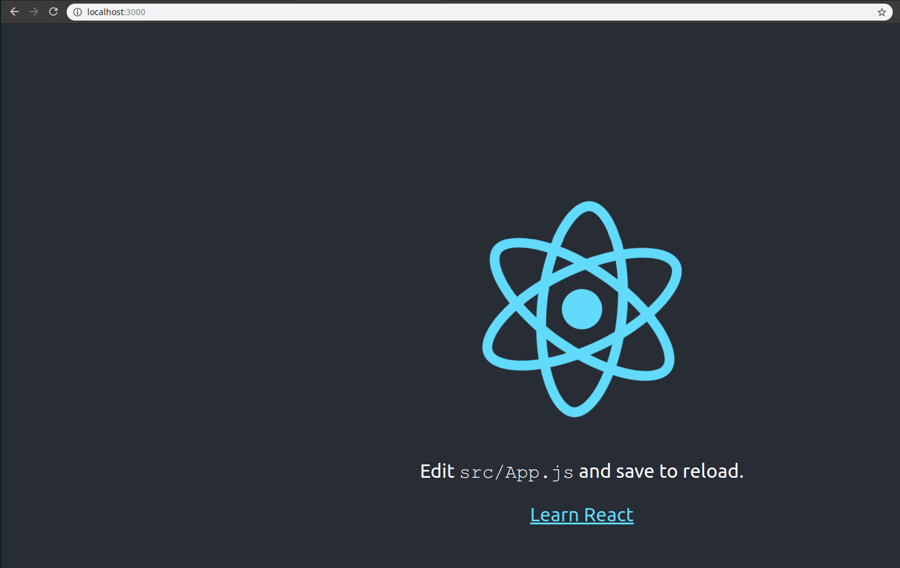

# Starting the container

We can use `docker run` to start the development server.

```
davis@davis-arch  ~/projects/docker/04_react_app   master  docker run -p 3000:3000 3b1edaee87fb

> frontend@0.1.0 start /app
> react-scripts start

Starting the development server...

Compiled successfully!

You can now view frontend in the browser.

  Local:            http://localhost:3000/
  On Your Network:  http://172.17.0.2:3000/

Note that the development build is not optimized.
To create a production build, use npm run build.

```

And we'll see the react app:



But, if we change the source code, it will not change in the browser - they are not reflected in the container until we rebuild the image.

