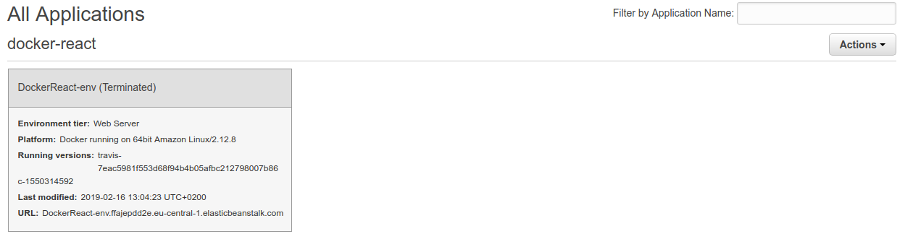
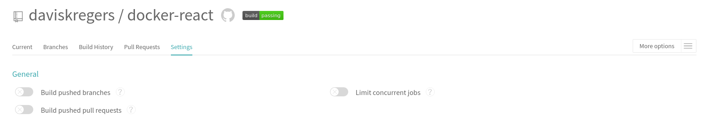

# Environment cleanup

At the end of this project you might want to delete the AWS environment in order not to get billed for it.

You can open up the environment and click `Actions -> terminate environment`.

After some time it will completely disappear.

Also, you might want to disable building the project on Travis CI side, since you only have 100 free builds before you need to start paying.

