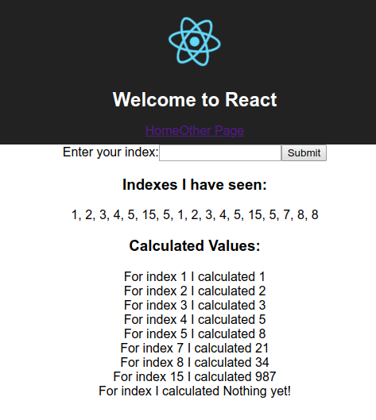

# Docker compose config

We'll add the `docker-compose.yml` file in the project directory.

```yml
version: '3'
services: 
  postgres:
    image: 'postgres:latest'
  redis:
    image: 'redis:latest'
  nginx:
    restart: always
    build:
      dockerfile: Dockerfile.dev
      context: ./nginx
    ports:
      - "3050:80"
  api:
    build:
      dockerfile: Dockerfile.dev
      context: ./server
    volumes:
      - /app/node_modules
      - ./server:/app
    environment:
      - REDIS_HOST=redis
      - REDIS_PORT=6379
      - PGUSER=postgres
      - PGHOST=postgres
      - PGDATABASE=postgres
      - PGPASSWORD=postgres_password
      - PGPORT=5432
  client:
    build:
      dockerfile: Dockerfile.dev
      context: ./client
    volumes:
      - /app/node_modules
      - ./client:/app
  worker:
    build:
      dockerfile: Dockerfile.dev
      context: ./worker
    volumes:
      - /app/node_modules
      - ./worker:/app
    environment:
      - REDIS_HOST=redis
      - REDIS_PORT=6379
```

And now, when starting `docker-compose up --build`  we'll rebuild all the images and start the service on port `3050`.

When visiting the `http://localhost:3050`:

