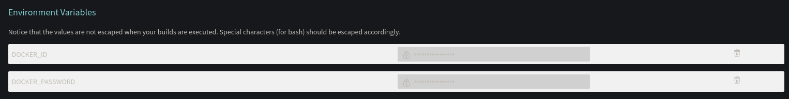
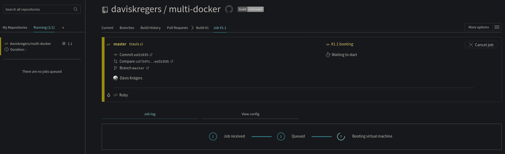
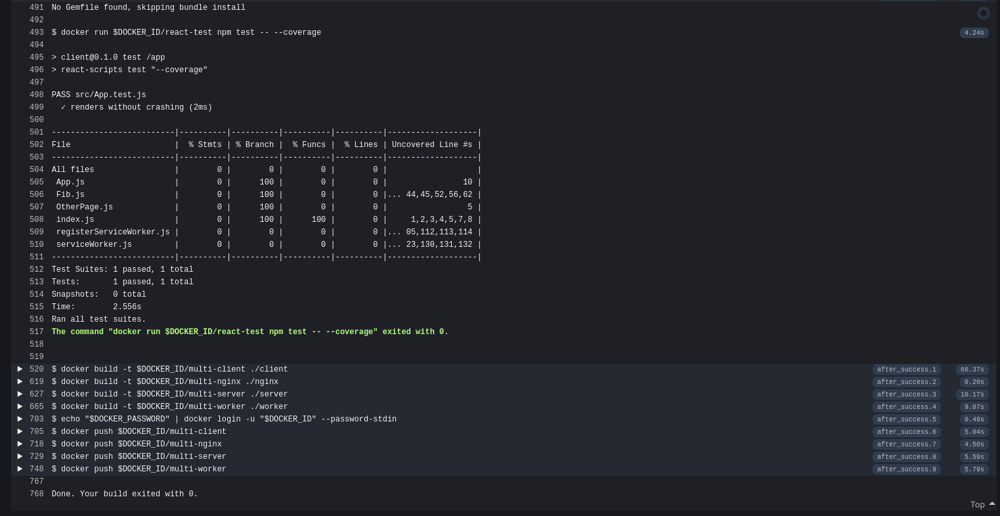
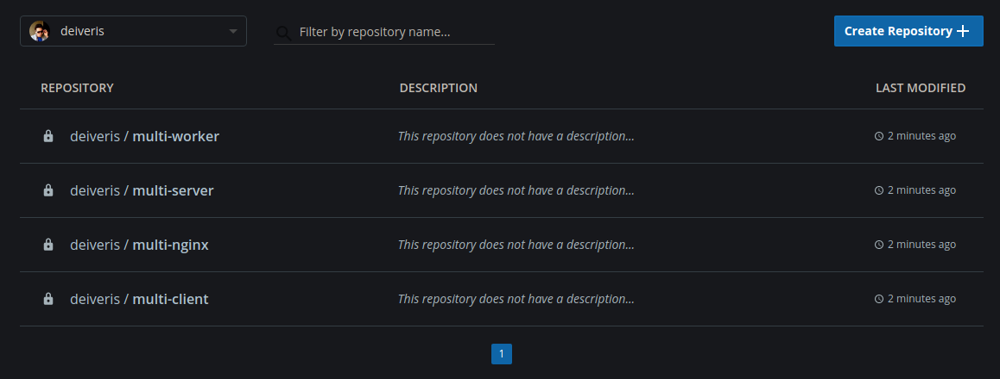

# Travis CI Configuration

Previously we created a github repository and added it to travis ci for building. But since there is no actual travis configuration, nothing will be ran.

So, we'll create configuration that:
1. Specifies docker as a dependency
2. Builds test version of react projkect
3. Runs tests
4. Build prod versions of all projects
5. Pushes all containers to docker hub
6. Tells Elastic Beanstalk to update

Because pushing to docker hub  will require credentials, we'll go to `multi-docker -> settings` in TravisCI and set up environment variables.



Not we'll create `.travis.yml` in the project:

```yml
sudo: required
services:
  - docker

before_install:
  # bulid tests
  - docker build -t $DOCKER_ID/react-test -f ./client/Dockerfile.dev ./client

script:
  # run tests
  - docker run $DOCKER_ID/react-test npm test -- --coverage

after_success:
  # build production images
  - docker build -t $DOCKER_ID/multi-client ./client
  - docker build -t $DOCKER_ID/multi-nginx ./nginx
  - docker build -t $DOCKER_ID/multi-server ./server
  - docker build -t $DOCKER_ID/multi-worker ./worker
  # Login to docker CLI
  - echo "$DOCKER_PASSWORD" | docker login -u "$DOCKER_ID" --password-stdin
  # Take images and push to docker hub
  - docker push $DOCKER_ID/multi-client
  - docker push $DOCKER_ID/multi-nginx
  - docker push $DOCKER_ID/multi-server
  - docker push $DOCKER_ID/multi-worker
```

And push it to github.

Now we can see that Travis CI is building the project:



After some time it finishes with success:



And the images have been pushed to docker hub

