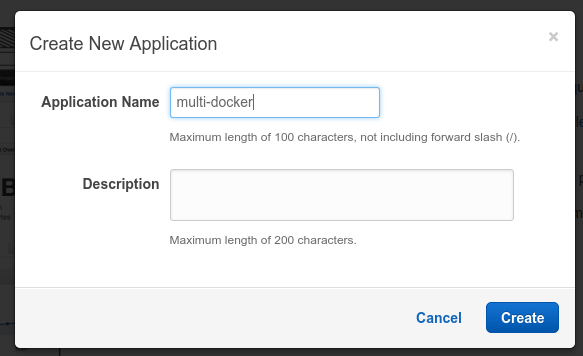
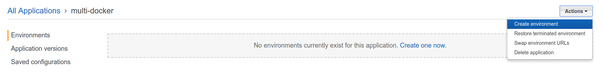
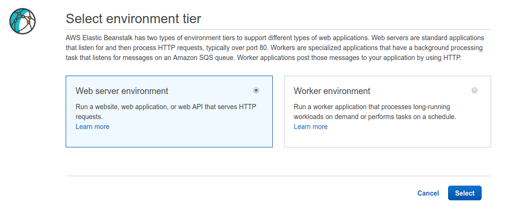
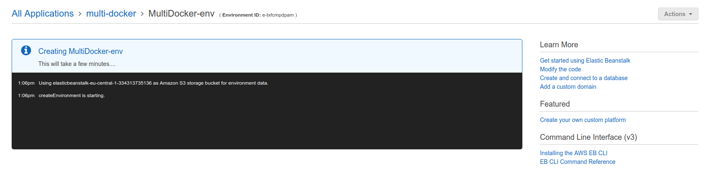
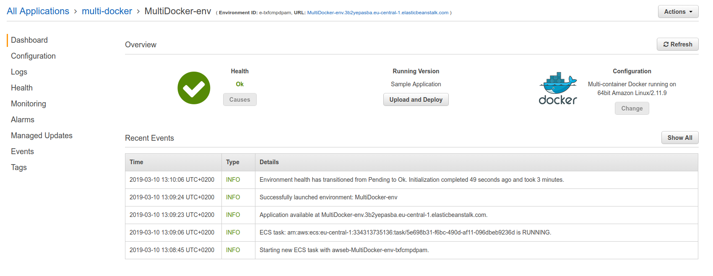
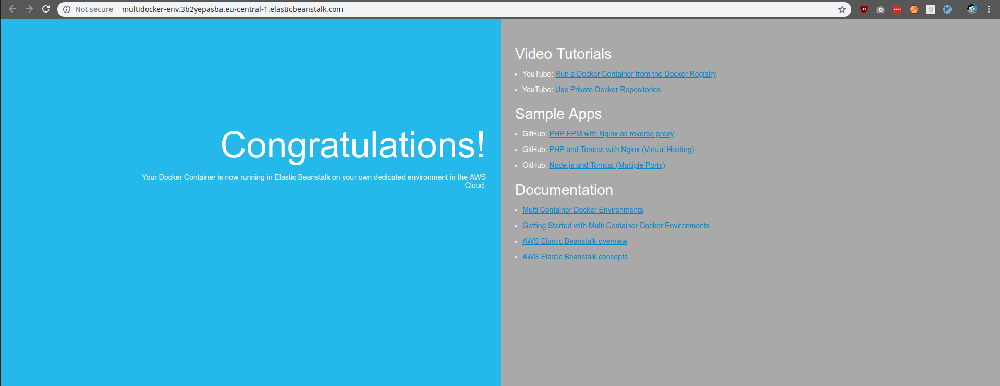

# Creating the EB environment

Now that the `Dockerrun.aws.json` is set up, we'll need to create the Elastic Beanstalk environment.
To do that we'll log into the `AWS Management Console` and go to the `Services -> Elastic Beanstalk` and click on the `Create New Application`.

Now we'll create a new environment

Select the `Web server` environemnt:

In the next form, everything can stay as it is except for the `Platform` section. Select thge `Multi-container Docker` option.

And click on the `Create Environment`.

Now it will take some time to create the environment:

When it's finished, you'll be redirected to a page like this:

And when visiting the environment URL, you'll see the sample app.

