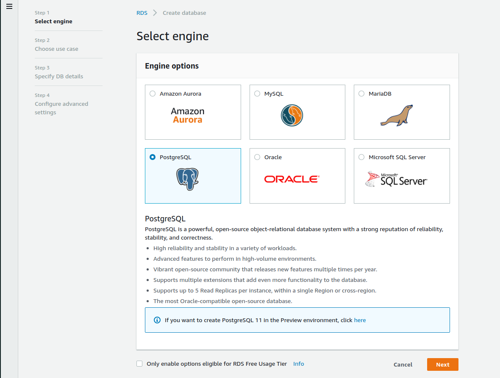
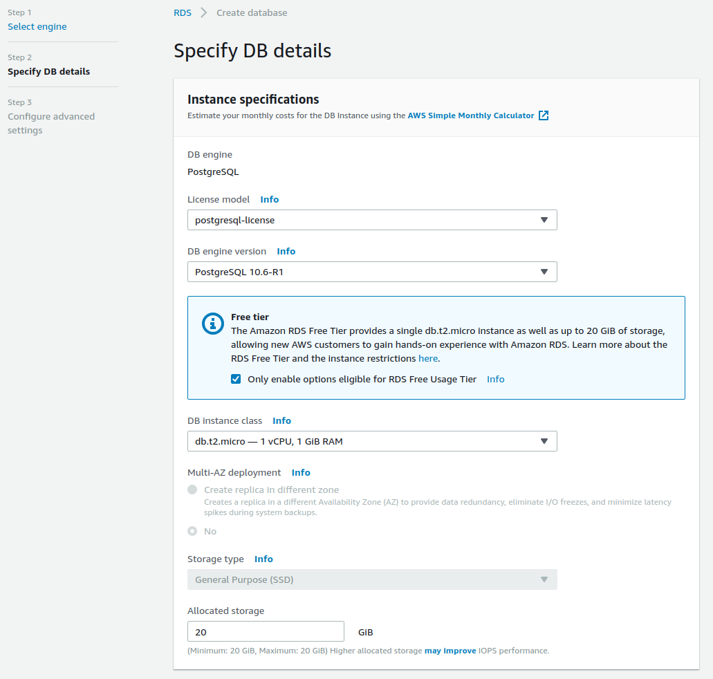
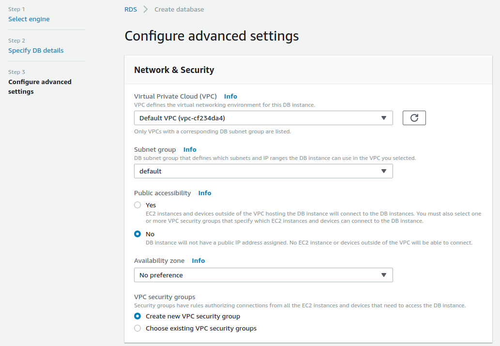
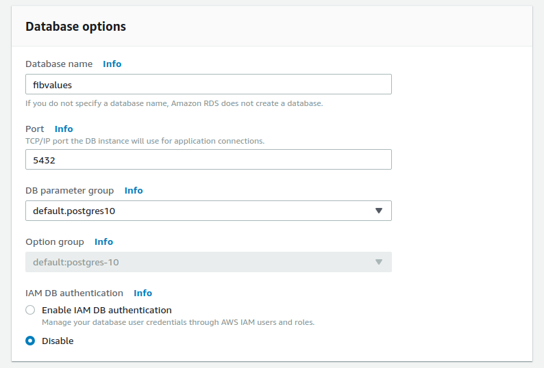
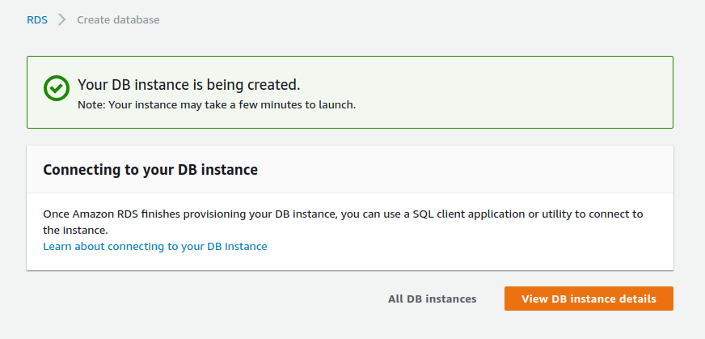
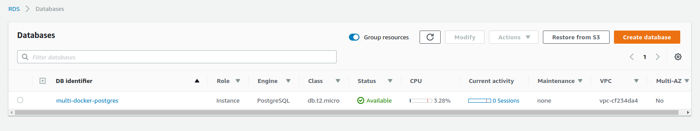

# RDS Database creation

We'll create the PostgreSQL server in RDS.

To do this, we'll go to `Services -> RDS` and find a section called `Create database` and click on it, then we'll be able to choose the database we want.

We'll select the PostgreSQL

Now you'll be able to configure it as you want, but the default settings should suffice. If you checked the `Only enable options eligible for RDS Free Usage Tier` in the previous step, your only option will be to use `db.t2.micro` instance class.

We'll need to fill out the settings though:

Now, on the next step, we'll want to put the database on our default VPC and select `Public accessibility` as `No`.

Specify the database name:

You can also setup more things like backups, monitoring, performance insights etc, but currently we don't need that.

Now, when clicking on `Create database`, it will redirect to a page like this and it will take a few minutes to create the database.

After some time you'll see that it is available:

