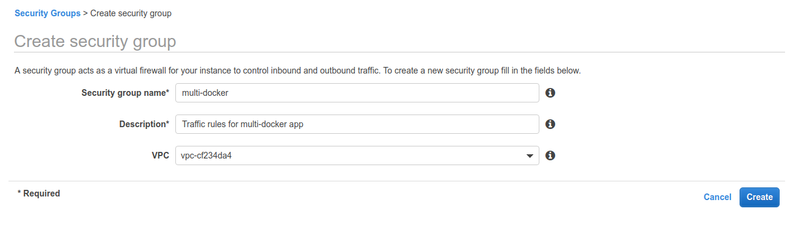
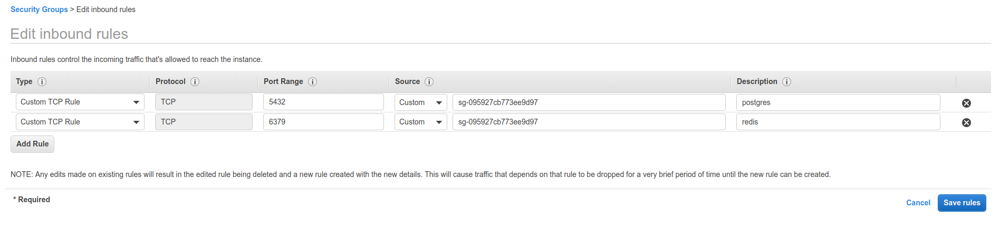

# Creating a custom security group

To create a new `security group`, we'll go to `Services -> VPC Dashboard -> Security -> Security Groups`.

Now we'll create a new security group to allow communication between EB, RDS and EC.

We'll click on create and then we'll see it in the security group list.
We'll select the `multi-docker` security group, go to `Inbound Rules` tab and click on `edit`.

Create inbound ports for postgres and redis, source will be the security group ID.

