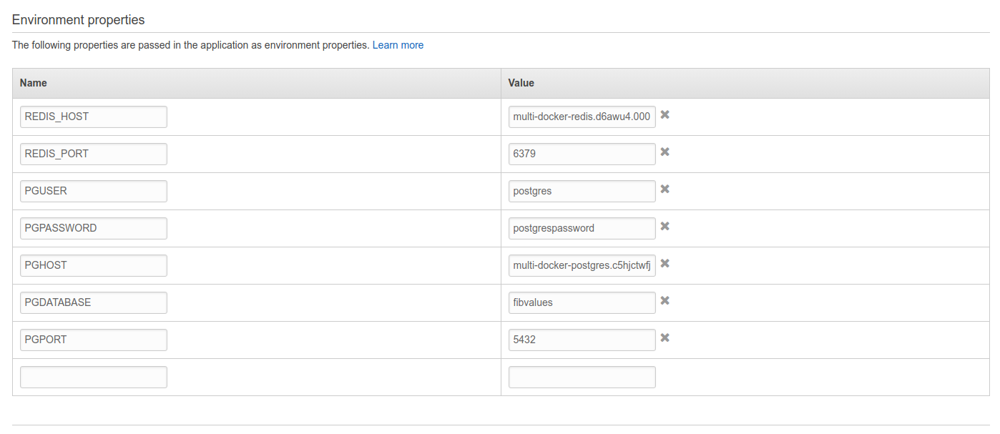
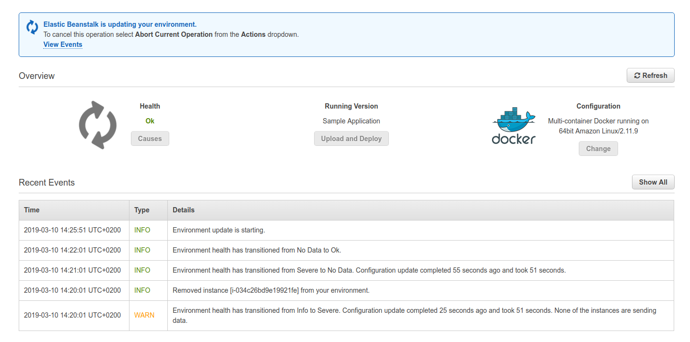

# Setting environment variables

To setup ELB environment variables, we can go to `Services -> Elastic Beanstalk -> MultiDocker-env -> Configuration -> Software` and set up the `Environment properties`.

And when hitting on apply, it will take some time to apply them:

