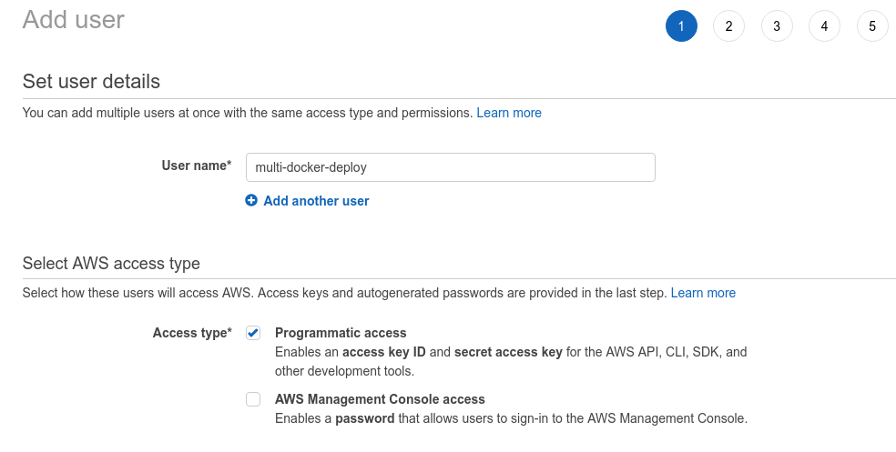
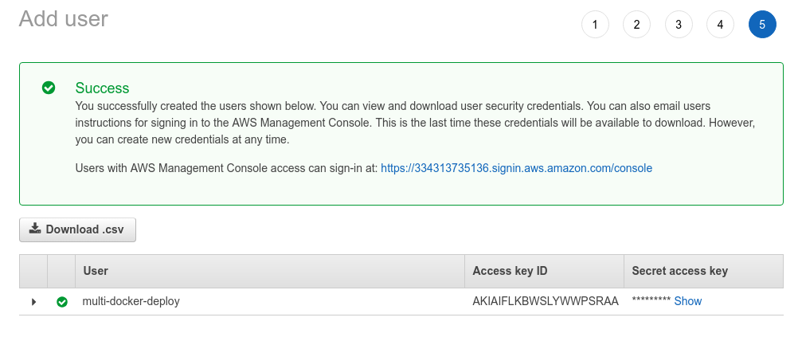
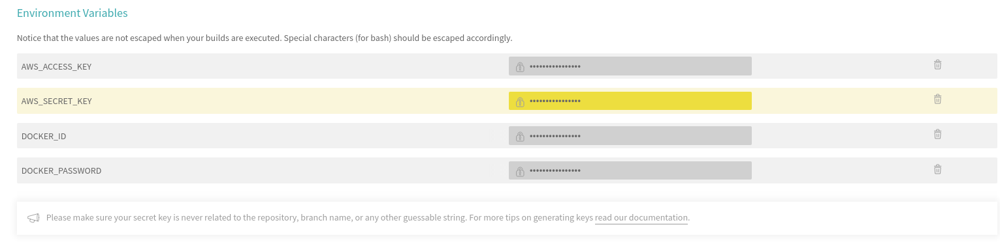

# IAM Keys for deployment

Now, when everything is ready, we'll go to `Services -> IAM -> Users` and create a new user for deploying the application.

Make sure to check the `Programmatic access` box.

We'll attach existing policies that are related to beanstalk:

And create the user:

Now, we'll go to `Travis CI`, open up the repository settings and set them up as environment variables:

