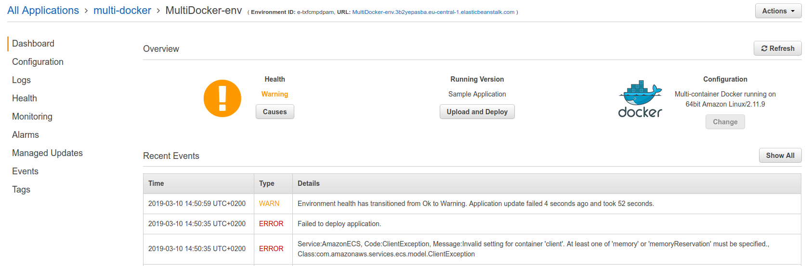

# Container memory allocations

Now, when pushing the project to AWS, it might fail with a following error:



This is complaining that we need to specify an option called `memory`. This can be done in the `Dockerrun.aws.json` file.

```json
{
    "AWSEBDockerrunVersion": 2,
    "containerDefinitions": [
        {
            "name": "client",
            "image": "deiveris/multi-client",
            "hostname": "client",
            "essential": false,
            "memory": 128
        },
        {
            "name": "server",
            "image": "deiveris/multi-server",
            "hostname": "api",
            "essential": false,
            "memory": 128
        }, 
        {
            "name": "worker",
            "image": "deiveris/multi-worker",
            "hostname": "worker",
            "essential": false,
            "memory": 128
        },
        {
            "name": "nginx",
            "image": "deiveris/multi-nginx",
            "hostname": "nginx",
            "essential": true,
            "portMappings": [
                {
                    "hostPort": 80,
                    "containerPort": 80
                }
            ],
            "links": ["client", "server"],
            "memory": 128
        }
    ]
}
```

Every container has now 128mb of memory allocation, which might not be the best case, but it should work for a test.

