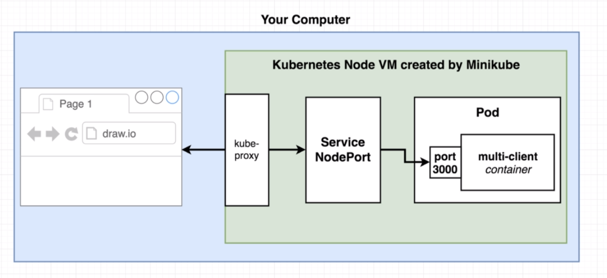
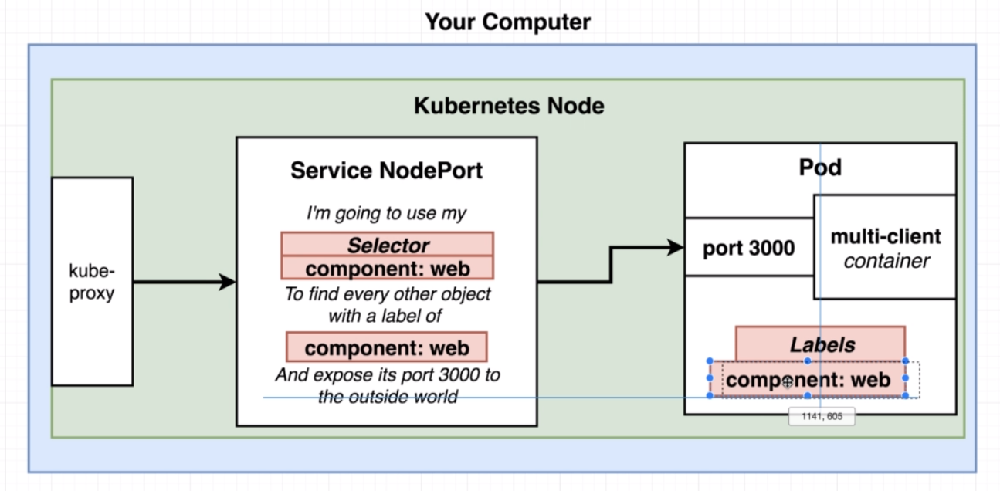
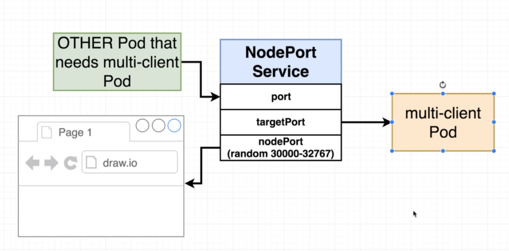

# Service config files in depth

Previously we looked at `Pods` which are used for running one or more closely related containers.

Now, we'll look at `Services` which are used to set up networking in a kubernetes cluster.

There are 4 subtypes for `Service`:
- ClusterIP
- NodePort
- LoadBalancer
- Ingress

In our configuration file we chose `NodePort` type which is only good for development purposes, it is not to be used in production environment with exceptions.

So, basically, our current configuration looks like this:

We can use this diagram to describe the configuration we previously made:

And the whole configuration will look like this:

