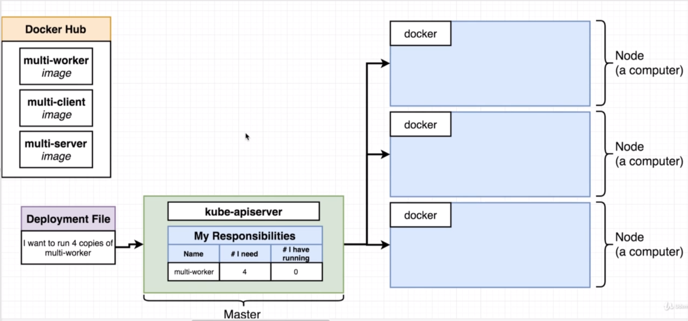
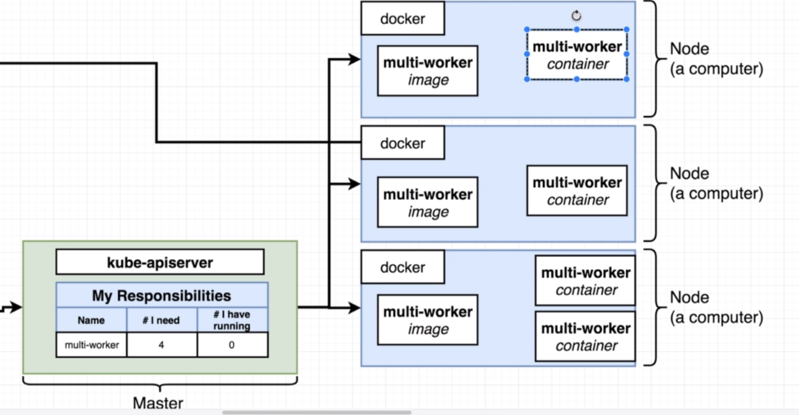
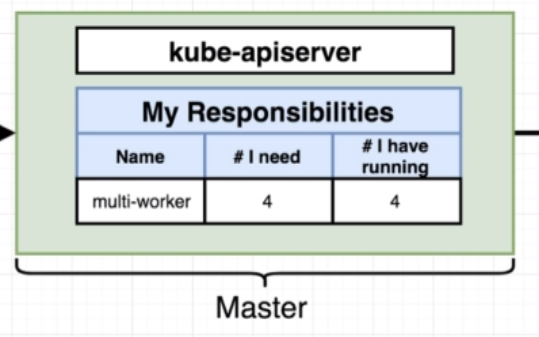

# The entire deployment flow

In this section we'll look into what really happened when we applied the configration to the kubernetes cluster.

When run the command `kubectl apply`, the file is taken and passed of to a `Master` that controls the `kubernetes` cluster, one of which is `kube-apiserver` which is responsible for monitoring the status of all the different nodes in the cluster and making sure that their are doing the correct things.

The `kube-apiserver` holds a table of it's state and updates it with the configuration passed.

Then, based on it's state, it issues commands to nodes.

For example, if we tell the master that we want 4 copies of `multi-worker`, it will update it's state table and will see that it needs to be running 4 copies of `multi-worker`, but has 0. It will issue commands to nodes to start up those containers.

Then, the node will download the  image from `docker hub` and start up the containers.

Then the Master will update poll the nodes and see that there are 4 containers of `multi-worker` running, update it's state table.

If for some reason one of these containers would be killed, the master would notice it and issue a command to the node to start it up again.