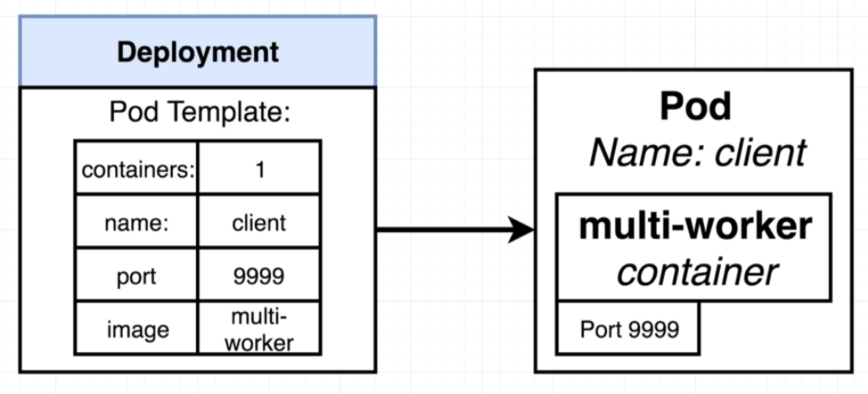

# Running containers with deployments

Previously we changed a port on the `client-pod` configuration and it threw an error saying that the property cannot be updated once the pod is created.

To solve this issue, we can make use of a different object called `Deployment`. It maintains a set of identical pods, ensuring that they have correct config and that the right number exists.

## The pod

- Runs a single set of containers
- Good for one-off dev purposes
- Rarely used directly in production

## Deployment

- Runs a set of identical pods (one or more)
- Monitors the state of each pod, updating as necessary
- Good for dev
- Good for production

When we create a deployment, it has an attached pod template that describes how the pods should look like.
If we change the template, for example, the port. The deployment will attempt to change it in the pod or kill and recreate the pod.

