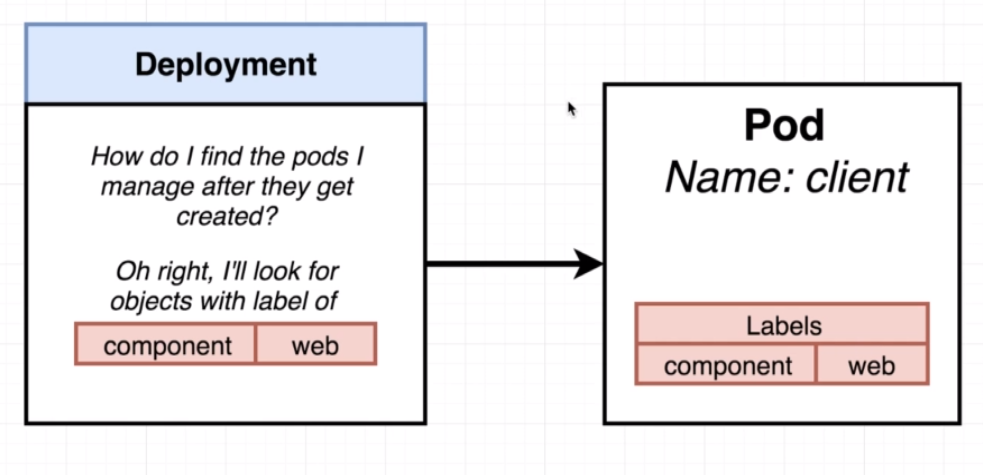

# Deployment configuration files

In order to create the deployment configuration file, we'll create a new `client-deployment.yml`  file :

```yaml
apiVersion: apps/v1
kind: Deployment
metadata:
  name: client-deployment
spec:
  replicas: 1
  selector:
    matchLabels:
      component: web
  template:
    metadata:
      labels:
        component: web
    spec:
      containers:
        - name: client
          image: deiveris/multi-client
          ports:
            - containerPort: 3000
```

The `template` describes the `pod` to be created.
The `replicas` describes the number of `pods` to make.
The `selector` describes a handle for the deployment to find the pod after it's created.

