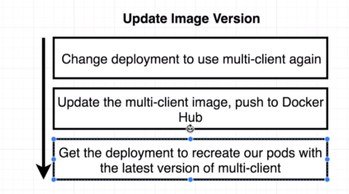

# Updating deployment images

In the next sections we are going to see on how to make a realistic deployments.

- First, we'll revert the changes in the deployment to use the `multi-client`
- We are going to update and push a new image to docker hub
- Get the deployment to recreate our pods with the latest verision of the image



So, we are changing the `client-deployment.yaml` file back to:

```yaml
apiVersion: apps/v1
kind: Deployment
metadata:
  name: client-deployment
spec:
  replicas: 1
  selector:
    matchLabels:
      component: web
  template:
    metadata:
      labels:
        component: web
    spec:
      containers:
        - name: client
          image: deiveris/multi-client
          ports:
            - containerPort: 3000
```

```
$ kubectl apply -f client-deployment.yaml
deployment.apps/client-deployment configured
$ kubectl get deployment
NAME                READY   UP-TO-DATE   AVAILABLE   AGE
client-deployment   1/1     1            1           20m
$ kubectl get pods
NAME                                 READY   STATUS        RESTARTS   AGE
client-deployment-69f476d99b-s4trm   0/1     Terminating   0          10m
client-deployment-7bf8c9b5c5-ptj4h   1/1     Running       0          11s
```

And check that we can still access it:

```
$ minikube ip
192.168.99.101
```

And visit `http://192.168.99.101:31515/`.

