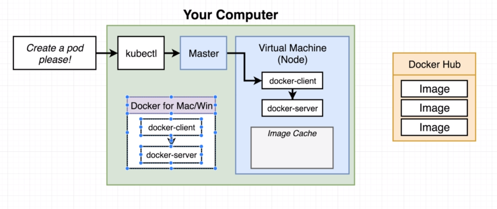
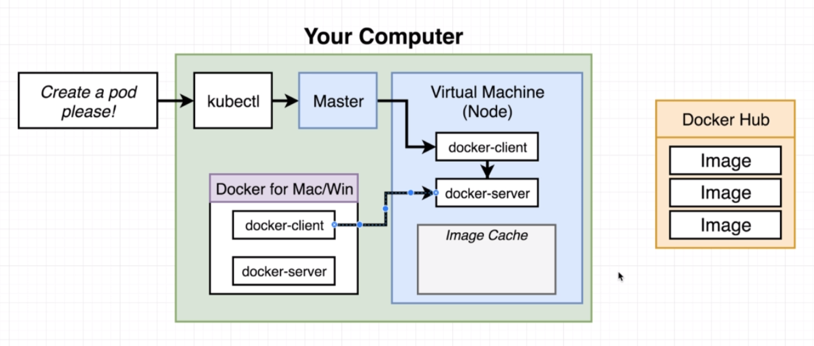

# Multiple docker installations

We can use docker cli to reach into the kubernetes node to see what exactly is going on.
Currently, we have 2 docker installations on our local machine - one is installed normalle, one is inside the virtual machine for the `node`.

