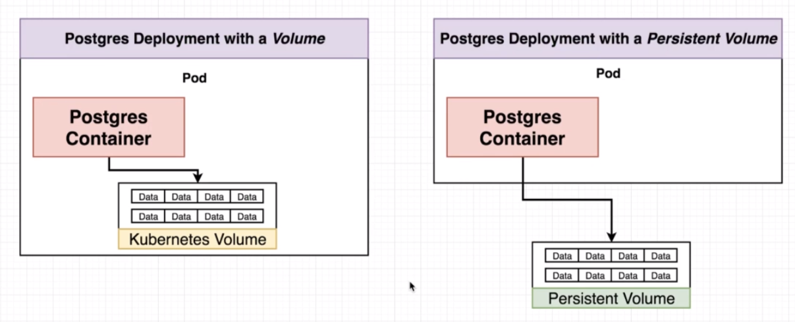

# Volumes vs Persistent volumes

The volume object is stored into the pod, if the postgres container crashes, the data persists and a new container can read it. However, if entiire pod crashes, the data is gone.

The Persistent Volume is not tied to any specific pod. 

