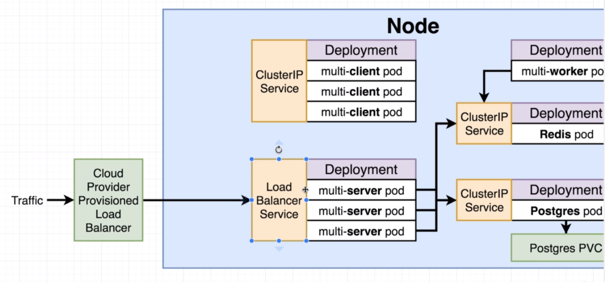

# Load balancer services

Previously we set up all the Deployments and ClusterIP services, but we still need to somehow route all the traffic to these services.

We are starting to wire up an `Ingress Service`.

In this section we will look at the `LoadBalancer` service and why we are not going to use it.

It is a legacy way of getting network traffic into a cluster. It does two separate things:
- Allow to access only one set of pods
- Kubernetes will reach out to cloud provider and create a load balancer using their configuration

