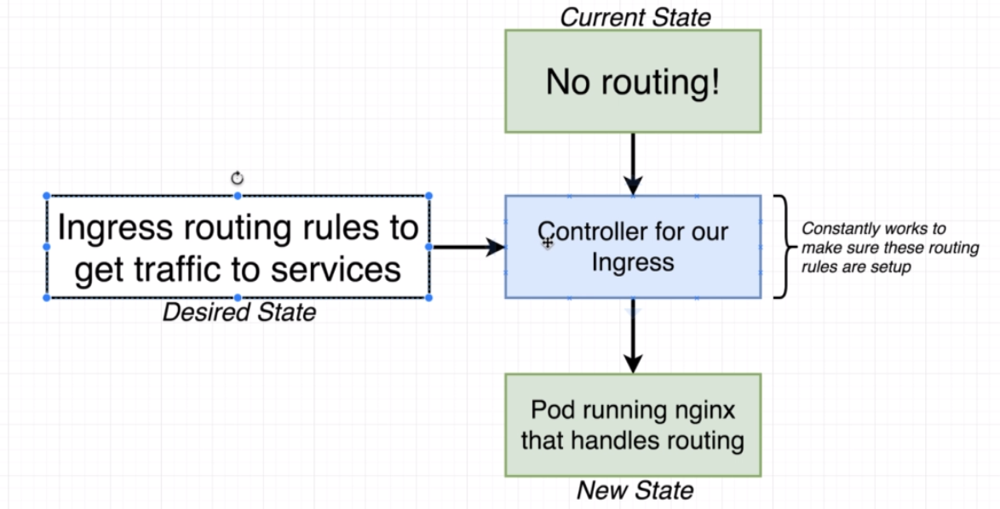
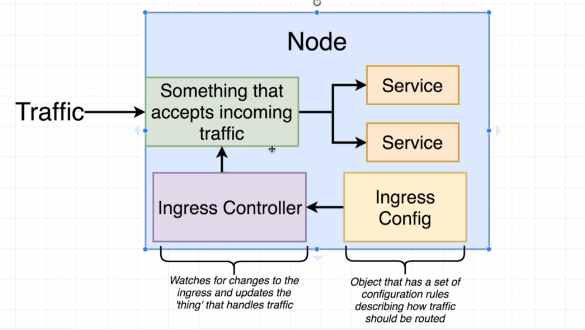

# Behind the scenes of Ingress

We are going to set up an ingress controller, which is using nginx behind the scenes.
This will create a pod running nginx that sends traffic further into the cluster based on the config.

We are making use of the `ingres-nginx` instead of configuring our own nginx pod because it is more aware that it is in a kubernetes cluster. Instead of sending requests to ClusterIP services, it will send them straight to the pods, which can be a must in situations where we need sticky sessions etc.

More reading on `ingress-nginx` is available at [https://www.joyfulbikeshedding.com/blog/2018-03-26-studying-the-kubernetes-ingress-system.html](https://www.joyfulbikeshedding.com/blog/2018-03-26-studying-the-kubernetes-ingress-system.html).