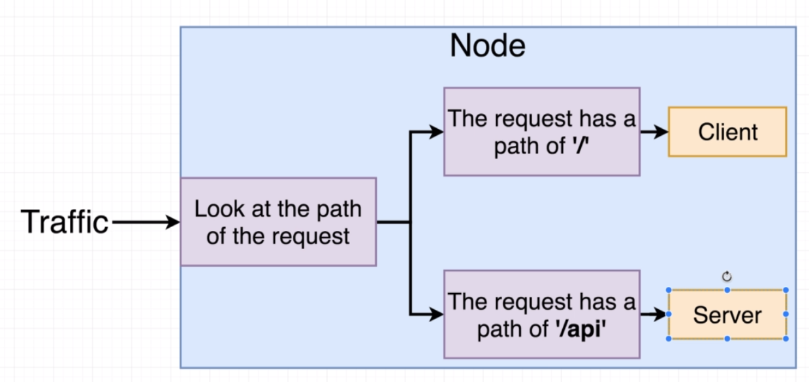

# Creating the ingress config

Now the last thing we need to do is to create ingress config simillary like we did when we created our own nginx server with ELB.



Create `k8s/ingress-service.yaml` file:

```yaml
apiVersion: extensions/v1beta1
kind: Ingress
metadata:
  name: ingress-service
  annotations:
    kubernetes.io/ingress.class: nginx
    nginx.ingress.kubernetes.io/rewrite-target: /
spec:
  rules:
    - http:
        paths:
          - path: /
            backend:
              serviceName: client-cluster-ip-service
              servicePort: 3000
          - path: /api/
            backend:
              serviceName: server-cluster-ip-service
              servicePort: 5000
```

Now apply:

```
$ kubectl apply -f k8s
service/client-cluster-ip-service unchanged
deployment.apps/client-deployment unchanged
persistentvolumeclaim/database-persistent-volume-claim unchanged
ingress.extensions/ingress-service created
service/postgres-cluster-ip-service unchanged
deployment.apps/postgres-deployment unchanged
service/redis-cluster-ip-service unchanged
deployment.apps/redis-deployment unchanged
service/server-cluster-ip-service unchanged
deployment.apps/server-deployment unchanged
deployment.apps/worker-deployment unchanged
```
