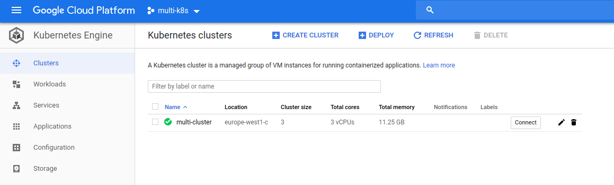
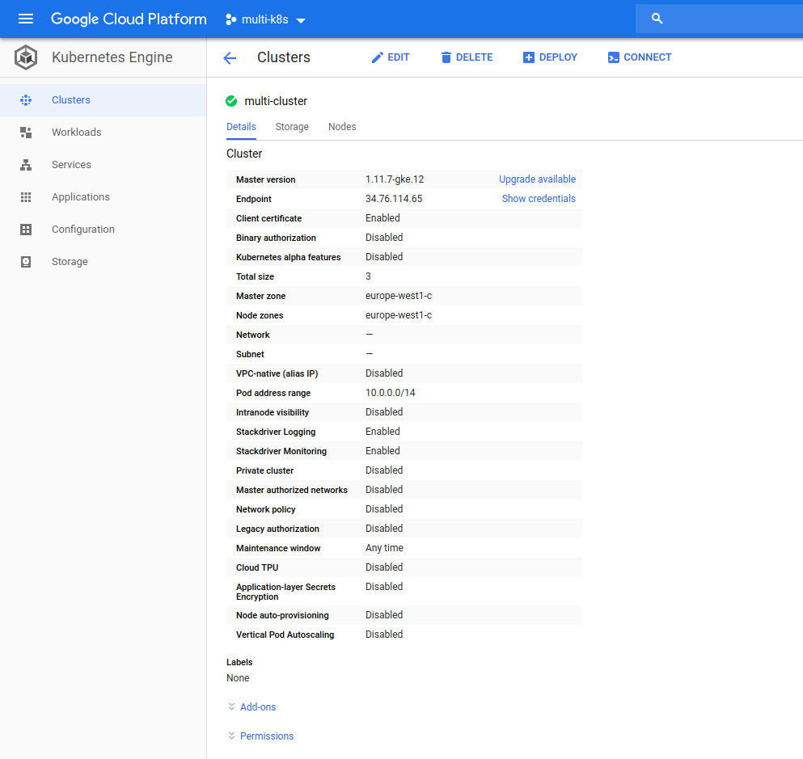
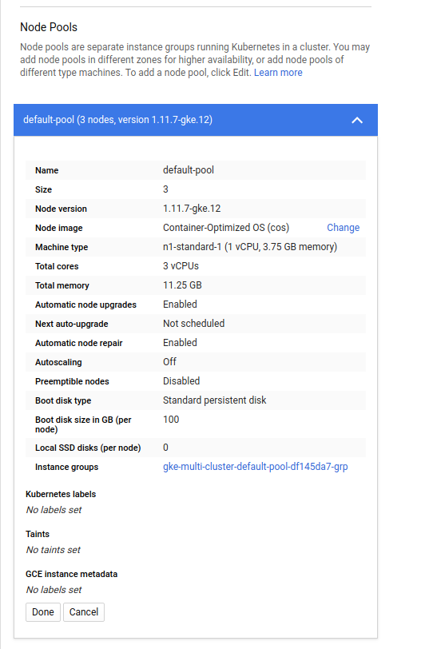

# Kubernetes dashboard on Google Cloud

When the cluster has been created, it will look like this:

We can click on the `multi-cluster` and it will display information for it.

In the left menu there are multiple other sections like:

1. `Workloads` - display all the pods and deployments that belong to the application
2. `Services` - all the services in the cluster
3. `Applications` - different plugins / 3rd party software to install in our cluster
4. `Configuration` - all environment configuration / secrets
5. `Storage` - list all persistent volumes and persistent volume claims.

