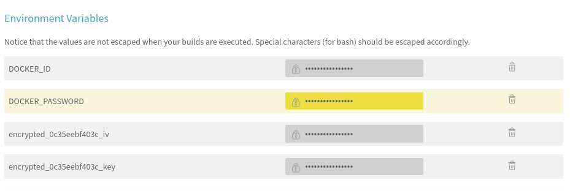

# Running tests with Travis


We are going to modify the .travis.yaml file to include tests. The docker credentials have been set up like [Travis Configuration](../10_CI_integration_workflow_for_multiple_images/05_travis_configuration.md).



The encrypted variables were automatically generated when encrypting the service account file.

```yaml
sudo: required
services:
  - docker
before_install:
  - openssl aes-256-cbc -K $encrypted_0c35eebf403c_key -iv $encrypted_0c35eebf403c_iv -in service-account.json.enc -out service-account.json -d
  - curl https://sdk.cloud.google.com | bash > /dev/null;
  - source $HOME/google-cloud-sdk/path.bash.inc
  - gcloud components update kubectl
  - gcloud auth activate-service-account --key-file service-account.json
  - gcloud config set project multi-k8s-236808
  - gcloud config set compute/zone europe-west1-c
  - gcloud container clusters get-credentials multi-cluster
  - echo "$DOCKER_PASSWORD" | docker login -u "$DOCKER_ID" --password-stdin
  - docker build -t deiveris/react-test -f ./client/Dockerfile.dev ./client

script:
  - docker run deiveris/react-test npm test -- --coverage
```

