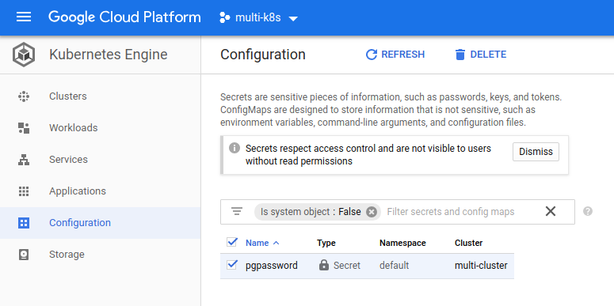

# Creating a secret on google cloud

Previously we connected to the `Google Cloud CLI` and selected the container we want to work with.
Now we are going to set up the secrets.

```
kubectl create secret generic pgpassword --from-literal PGPASSWORD=thepassword123
```

After running the command, we can see the secret under the `Configuration` tab.

