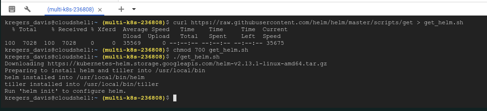

# Helm setup

Previously we had setup an `ingress` service in the `k8s` directory. It relies on the `ingress-nginx` project. [15_handling_traffic_with_ingress_controllers/04_setting_up_ingress_locally](../15_handling_traffic_with_ingress_controllers/04_setting_up_ingress_locally.md)

We have to set it up on Google Cloud service now.

We can find the commands for this at [https://kubernetes.github.io/ingress-nginx/deploy/](https://kubernetes.github.io/ingress-nginx/deploy/).

But, different than the last time, we are going to use Helm. It is a programm that can be used to administer 3rd party software inside our kubernetes cluster. 

It uses 2 separate pieces of software - `helm` and `tiller`. The helm is a client to `tiller` that sits inside the cluster and issues commands to modify objects in it.

The documentation for it can be found at [helm.sh/](https://helm.sh/).

We are going to use the [Quckstart Guide](https://helm.sh/docs/using_helm/#quickstart-guide).
And find the `Installing Helm -> From script` section.

```
$ curl https://raw.githubusercontent.com/helm/helm/master/scripts/get > get_helm.sh
$ chmod 700 get_helm.sh
$ ./get_helm.sh
```

And paste it into the `Google Cloud Shell`.



The `Google Cloud Console` now is saying that we should run `helm init`, but **`do not run it yet`** as we need to add some extra setup first.