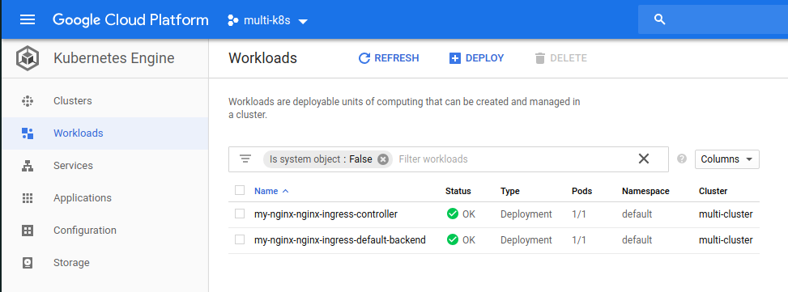
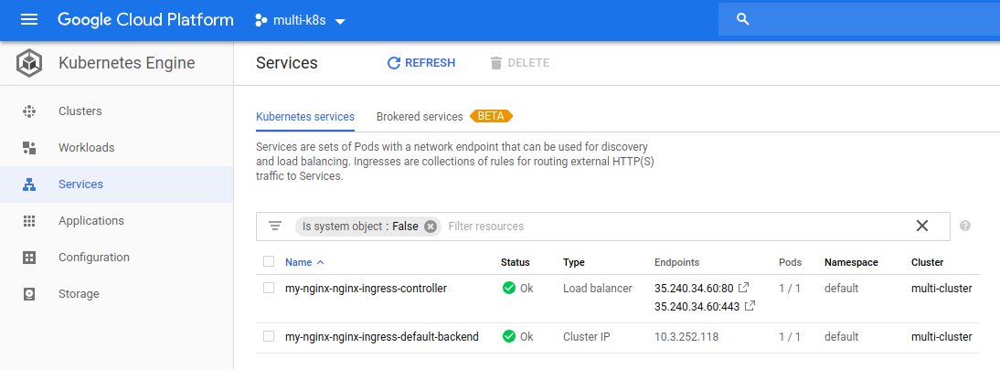
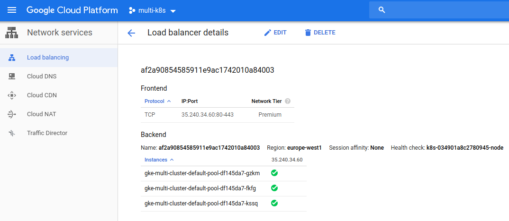

# The Result of ingress-nginx

Now, after when we have run the `helm` initialization, we can go to `Kubernetes Engine -> Workloads` and see that there is an nginx-ingress deployments.

Also, under `Services` section, there should be a `Load Balancer` with two endpoints:

We can go to `Network Services -> Load Balancing`, we can find a load balancer that is linked to our 3 nodes:

So, now, the final step is to actually deploy our application.

