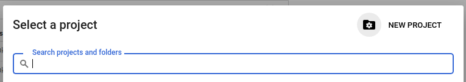
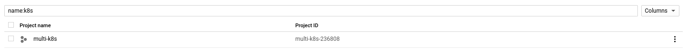
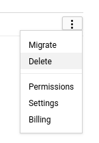
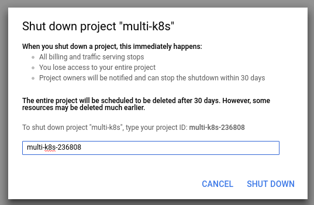
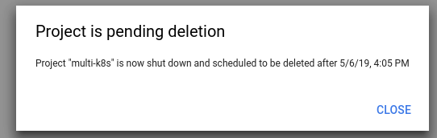

# Google Cloud cleanup

1. Click on the Project Selector on the Top Left corner of the page

2. Click on the gear icon on the right:

3. Find your project in the list of projects that is presented, then click the three dots on the far right hand side

4. Click Delete

5. Enter the project ID and shut down

6. The project will be deleted after 30 days

