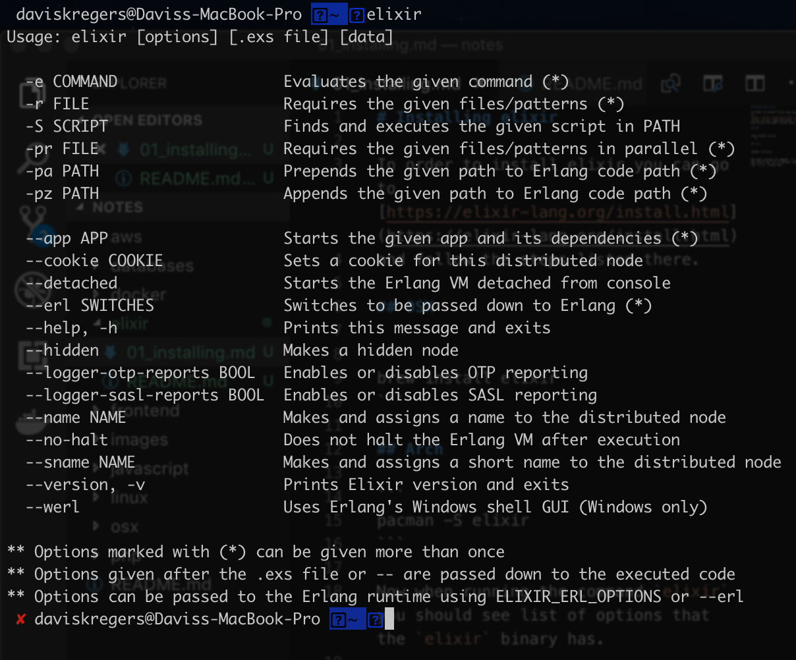

# Installing elixir

In order to install elixir you can go to [https://elixir-lang.org/install.html](https://elixir-lang.org/install.html)
and follow the steps listed there.

## OSX 

```bash
brew install elixir
```

## Arch

```bash
pacman -S elixir
```

Now when running the command `elixir` you should see list of options that the `elixir` binary has.

