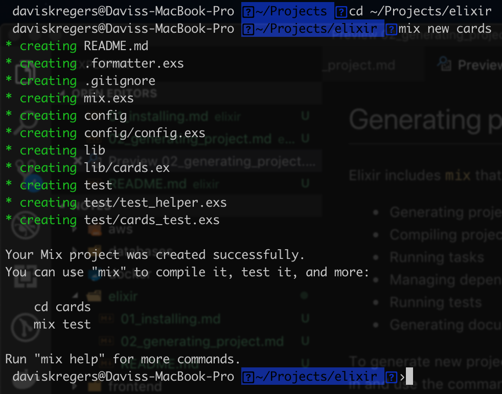

# Generating project

Elixir includes `mix` that is a `CLI`. It is used to do tasks like:
- Generating projects
- Compiling projects
- Running tasks
- Managing dependencies
- Running tests
- Generating documentation

To generate new project, go into the directory you want to create the project in and use the command:

```bash
cd ~/Projects/elixir
mix new cards
```



This will generate several files like the main module, config, tests etc.