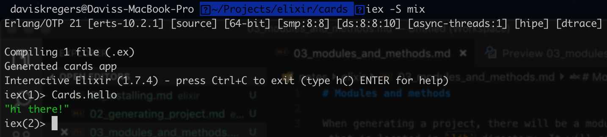

# Modules and methods

When generating a project, there will be a module generated, that is located in `lib` directory. It will contain something like this.

```elixir
defmodule Cards do
end
```

This file defines a single module in the code, using the `defmodule` keyword, it is called `Cards`. Nearly all code in elixir is organized in various modules.

You can add a method using following syntax:

```elixir
def hello do
    "hi there!"
end
```

The `def` keyword defines a new method called `hello` that returns `hi there!` string. 

The elixir has a thing called `implicit return` which means that whenever a function runs, whatever the last value is - it will get returned, so the keyword `return` is not used.

You can run the method by going into your terminal and running:

```bash
iex -S mix
Cards.hello
```

The `iex` is called `Interactive Elixir Shell` where you can interactively work with elixir.

