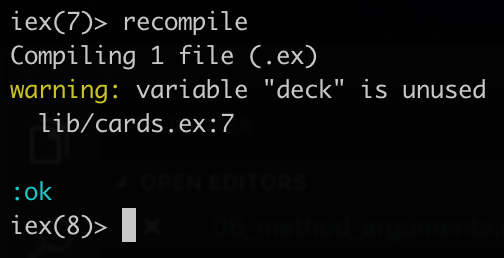
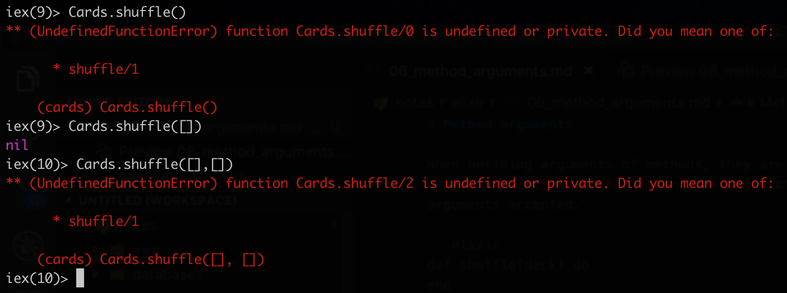

# Method arguments

When defining arguments of methods, they are defined after the function name, listing all names of the arguments accepted.

```elixir
def shuffle(deck) do 
end
```

When compiling the code, elixir will track whether the arguments are used or not and give feedback on it. For example, currently it will give a warning that the `deck` argument is not being used.



In elixir, we can have multiple methods with the same name, each of these methods can accept different numbers and types of arguments.

For example, if we call the `shuffle` method without any arguments, there will be an error thrown that will say that the module does not contain a `shuffle` method with no arguments, but it does contain `shuffle` method with 1 argument. Same, if we provide 2 arguments.

