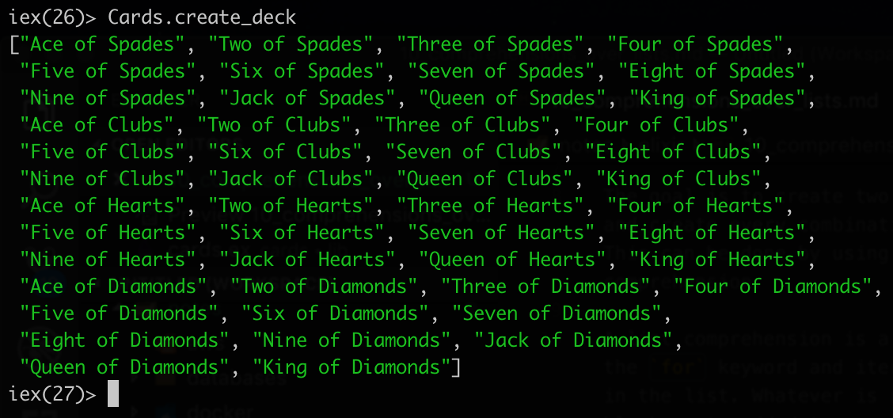

# Comprehensions over lists

Previously we used only elixir standard library, specifically the Enum module to handle the cards. 
But we will require some custom logic.

For example, currently the `create_deck` method only returns a list of `Ace`, `Two` and `Three`. It does not have any concept of suits.

The goal is to create two lists - values and suits and create every combination of those two lists. This can be done by using something list comprehension.

A list comprehension is a mapping function. It uses the `for` keyword and iterates over all the elements in the list. Whatever is returned from the `do` block, gets added to a newly created list.

```elixir
for suit <- suits do
    suit
end
```

will return `["Ace", "Two", "Three"]`

Since we have two lists, we need to solve a comprehension for nested arrays. Using a `for` in a `for` comprehension will return a `2D list`. This can be solved by using `List.flatten` method.

```elixir
def create_deck do
    values = ["Ace", "Two", "Three", "Four", "Five", "Six", "Seven", "Eight", "Nine", "Jack", "Queen", "King"]
    suits = ["Spades", "Clubs", "Hearts", "Diamonds"]

    cards = for suit <- suits do
        for value <- values do
        "#{value} of #{suit}"
        end
    end

    List.flatten(cards)
end
```

This can be optimized, you can have multiple comprehensions running the same time, which will eliminate the extra steps like the `List.flatten` that is a unnecessary computation step.

```elixir
def create_deck do
    values = ["Ace", "Two", "Three", "Four", "Five", "Six", "Seven", "Eight", "Nine", "Jack", "Queen", "King"]
    suits = ["Spades", "Clubs", "Hearts", "Diamonds"]

    for suit <- suits, value <- values do
        "#{value} of #{suit}"
    end
end
```

