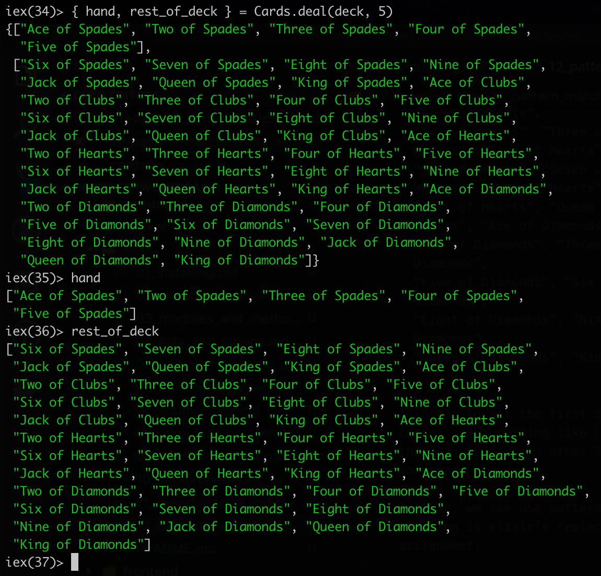

# Pattern matching

In previous section we got a tuple that contained a list of dealt hand cards and a list of the cards left in a deck.

```elixir
iex(32)> Cards.deal(deck, 5)
{["Ace of Spades", "Two of Spades", "Three of Spades", "Four of Spades",
  "Five of Spades"],
 ["Six of Spades", "Seven of Spades", "Eight of Spades", "Nine of Spades",
  "Jack of Spades", "Queen of Spades", "King of Spades", "Ace of Clubs",
  "Two of Clubs", "Three of Clubs", "Four of Clubs", "Five of Clubs",
  "Six of Clubs", "Seven of Clubs", "Eight of Clubs", "Nine of Clubs",
  "Jack of Clubs", "Queen of Clubs", "King of Clubs", "Ace of Hearts",
  "Two of Hearts", "Three of Hearts", "Four of Hearts", "Five of Hearts",
  "Six of Hearts", "Seven of Hearts", "Eight of Hearts", "Nine of Hearts",
  "Jack of Hearts", "Queen of Hearts", "King of Hearts", "Ace of Diamonds",
  "Two of Diamonds", "Three of Diamonds", "Four of Diamonds",
  "Five of Diamonds", "Six of Diamonds", "Seven of Diamonds",
  "Eight of Diamonds", "Nine of Diamonds", "Jack of Diamonds",
  "Queen of Diamonds", "King of Diamonds"]}
```

In order to get the first index from the tuple, we cannot use something like `Cards.deal(deck,4)[0]` that can be seen in other languages - it will throw an error.

Instead, we can use pattern matching. Pattern matching is elixir's replacement for variable assignment. 

```elixir
{ hand, rest_of_deck } = Cards.deal(deck, 5)
```

We write out a tuple on the left hand side, which matches the output of the `Cards.deal()` method, match the number of elements in the tuple - the first element is the `hand`, the second - `rest_of_the_deck`. 

So, we create a structure that matches the output of the method. 

When running this, the elements are assigned to the variables defined in the pattern matching assignment.



```elixir
 color1                  = ["red"]          # color1 = ["red"]
[color1]                 = ["red"]          # color1 = "red"
[color1, color2]         = ["red", "blue"]  # color1 = "red", color2 = "blue"
[color1, color2, color3] = ["red", "blue"]  # MatchError
```

Some more advanced usages of pattern matching is in [15_loading_from_filesystem.md](15_loading_from_filesystem.md), [21_identicon_generation_and_structs.md](21_identicon_generation_and_structs.md)