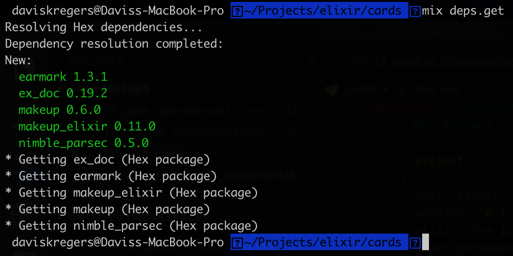
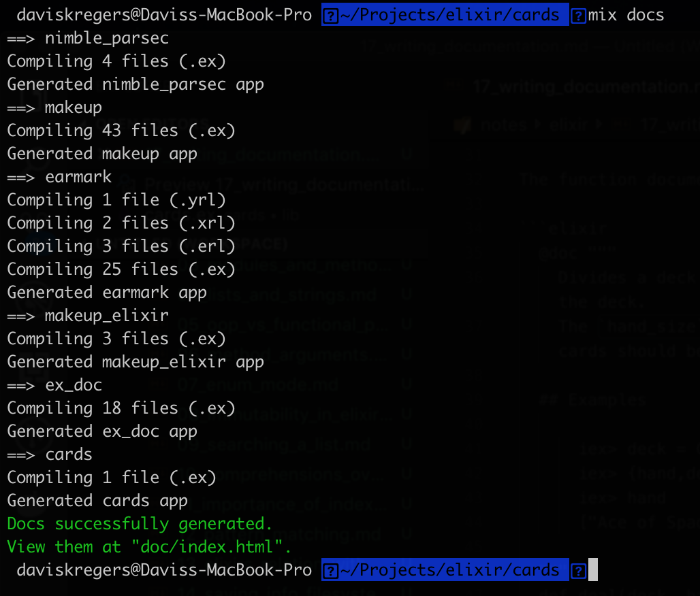
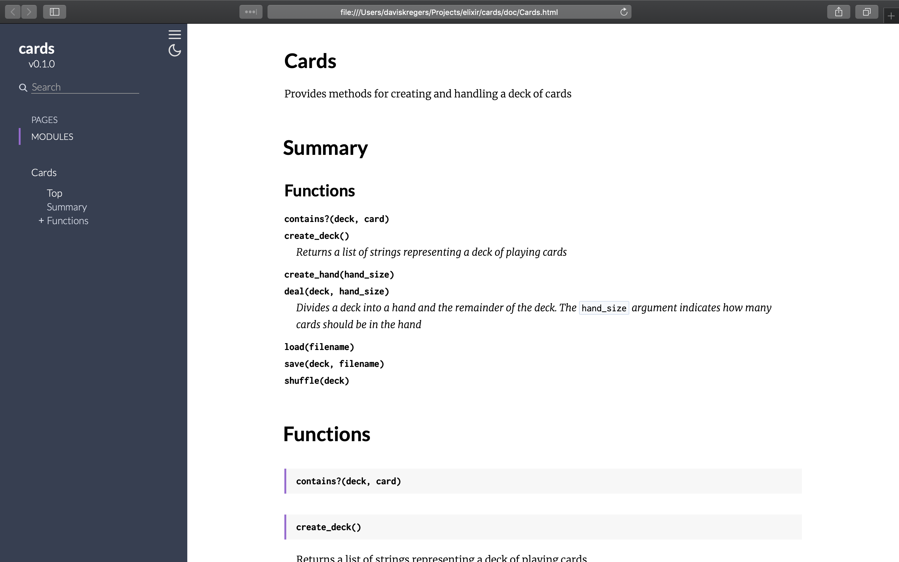
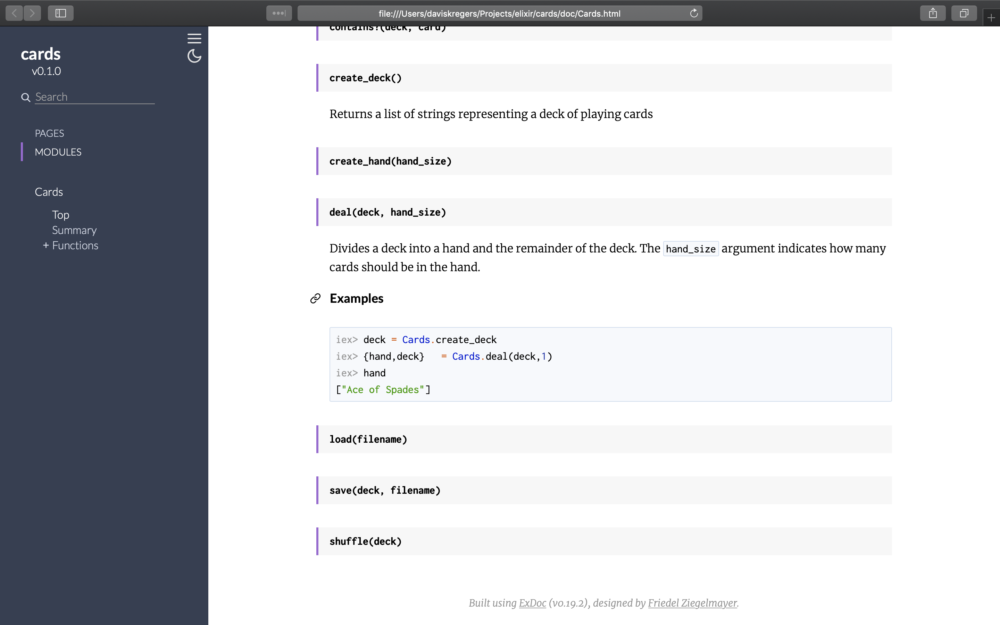

# Module documentation

We can add documentation to our project in two steps. 

The first step is to install a `ex_doc` package. That can be done by modifying the `mix.exs` file:

```elixir
defp deps do
    [
        {:ex_doc, "~> 0.19.2"}
    ]
end
```

And running the `mix deps.get` command.



There are two types of documentation - module documentation and function documentation. The module documentation is a summary-like documentation of saying what the module does overall. Then the function is used to document the usage of individual functions.

The module documentation can be added in a following manner:

```elixir
defmodule Cards do
  @moduledoc """
    Provides methods for creating and handling a deck of cards
  """
  ...
end
```

The function documentation can be added like this:

```elixir
  @doc """
    Divides a deck into a hand and the remainder of the deck.
    The `hand_size` argument indicates how many cards should be in the hand.
    
  ## Examples

      iex> deck = Cards.create_deck
      iex> {hand,deck}   = Cards.deal(deck,1)
      iex> hand
      ["Ace of Spades"]

  """
  def deal(deck, hand_size) do
    Enum.split(deck, hand_size)
  end
```

The documentation can be generated by using the `mix docs` command. It will generate a static html in the `doc` directory.





