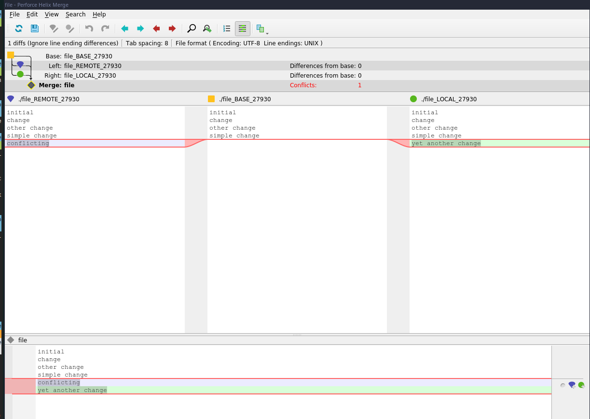

# Conflicting merge and resolution

```
davis@davis-arch  ~/projects/learning-git/project   master  git status
On branch master
nothing to commit, working tree clean
 davis@davis-arch  ~/projects/learning-git/project   master  git checkout -b conflicting-change
Switched to a new branch 'conflicting-change'
 davis@davis-arch  ~/projects/learning-git/project   conflicting-change  echo "conflicting">> file
 davis@davis-arch  ~/projects/learning-git/project   conflicting-change ●  git commit -am "Conflicting change"
[conflicting-change 5d495a8] Conflicting change
 1 file changed, 1 insertion(+)
 davis@davis-arch  ~/projects/learning-git/project   conflicting-change  git checkout master
Switched to branch 'master'
 davis@davis-arch  ~/projects/learning-git/project   master  echo "yet another change" >> file
 davis@davis-arch  ~/projects/learning-git/project   master ●  git commit -am "yet another change"
[master 14ae637] yet another change
 1 file changed, 1 insertion(+)
 davis@davis-arch  ~/projects/learning-git/project   master  git status
On branch master
nothing to commit, working tree clean
```

```
git log --oneline --decorate --graph --all

* 14ae637 (HEAD -> master) yet another change
| * 5d495a8 (conflicting-change) Conflicting change
|/  
*   620ff72 Mergin changes from simple-change Branch
|\  
| * 83f3159 simple change
* | 19ab207 file2
|/  
*   9521a8d Merge branch 'other-change'
|\  
| * a4d0bc9 Other change
|/  
* 5040750 Change file
* 84f00a8 add file
* 4e4ddba remove file
* e980c5c Add file
* aa6daef moved file
* a6a2066 Yello
* a635aaf initial

```

```
git diff master conflicting-change 

diff --git a/file b/file
index 811f265..0f9aba8 100644
--- a/file
+++ b/file
@@ -2,4 +2,4 @@ initial
 change
 other change
 simple change
-yet another change
+conflicting

```

```
davis@davis-arch  ~/projects/learning-git/project   master  git merge conflicting-change 
Auto-merging file
CONFLICT (content): Merge conflict in file
Automatic merge failed; fix conflicts and then commit the result.
```

Now we are in a merging state, we have to fix the merge manually.

```
✘ davis@davis-arch  ~/projects/learning-git/project   master ●✚ >M<  cat file
initial
change
other change
simple change
<<<<<<< HEAD
yet another change
=======
conflicting
>>>>>>> conflicting-change
```

You can fix them by hand, or use a graphical tool:

```
git mergetool
```



You can decide which side you want to use. I'm going to select the right side, and click "save".

```
davis@davis-arch  ~/projects/learning-git/project   master ✚ >M<  git mergetool
No files need merging
 davis@davis-arch  ~/projects/learning-git/project   master ✚ >M<  git status
On branch master
All conflicts fixed but you are still merging.
  (use "git commit" to conclude merge)

Changes to be committed:

	modified:   file

Untracked files:
  (use "git add <file>..." to include in what will be committed)

	file.orig

 davis@davis-arch  ~/projects/learning-git/project   master ✚ >M<  git commit -am "merge conflict"
[master fa79281] merge conflict
 davis@davis-arch  ~/projects/learning-git/project   master  git status
On branch master
Untracked files:
  (use "git add <file>..." to include in what will be committed)

	file.orig

nothing added to commit but untracked files present (use "git add" to track)
```

The `*.orig` file will be automatically created by the git so the changes hasn't been lost, we can add the `*.orig` to `.gitignore` to ignore these files.

```
git log --oneline --decorate --graph --all

*   fa79281 (HEAD -> master) merge conflict
|\  
| * 5d495a8 (conflicting-change) Conflicting change
* | 14ae637 yet another change
|/  
*   620ff72 Mergin changes from simple-change Branch
|\  
| * 83f3159 simple change
* | 19ab207 file2
|/  
*   9521a8d Merge branch 'other-change'
|\  
| * a4d0bc9 Other change
|/  
* 5040750 Change file
* 84f00a8 add file
* 4e4ddba remove file
* e980c5c Add file
* aa6daef moved file
* a6a2066 Yello
* a635aaf initial


```