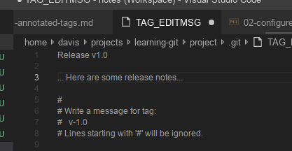

# Annotated tags

An annotated tag is similar to a simple tag, but it has extra annotated information. It usually has an equivalent information to a commit message.

```
  master  git status
On branch master
nothing to commit, working tree clean
  master  git tag -a v-1.0
  master  git tag --list

v-1.0

```



```
git log --oneline --decorate --graph

* b4ff9f3 (HEAD -> master, tag: v-1.0) Done with the WIP2
* 0ce9769 Done with the WIP2
* b419d7e Emergency fix
* c8d946a Done with the WIP
* b8e1096 Quick fix
* ddef7ba (bigtrouble) change after rebase
* 9066d92 fb adding trouble to file
* 0861e5d mb conflicting changes brewing
* 0c5efff mb before rebase conflicts
* 42f5865 Another change
* c671488 feature
* 02064fc edit
*   fa79281 merge conflict
|\  
| * 5d495a8 (conflicting-change) Conflicting change
* | 14ae637 yet another change
|/  
*   620ff72 Mergin changes from simple-change Branch
|\  
| * 83f3159 simple change
* | 19ab207 file2
|/  
*   9521a8d Merge branch 'other-change'
|\  
| * a4d0bc9 Other change
|/  
* 5040750 Change file
* 84f00a8 add file
* 4e4ddba remove file
* e980c5c Add file
* aa6daef moved file
* a6a2066 Yello
* a635aaf initial

```

```
git show v-1.0

tag v-1.0
Tagger: Dāvis Krēgers <kregers.davis@gmail.com>
Date:   Tue Jan 22 19:28:46 2019 +0200

Release v1.0

... Here are some release notes...

commit b4ff9f375867cd2ebdfee4d7ea7e1bed1485578d (HEAD -> master, tag: v-1.0)
Author: Dāvis Krēgers <kregers.davis@gmail.com>
Date:   Tue Jan 22 19:05:38 2019 +0200

    Done with the WIP2

diff --git a/file3 b/file3
new file mode 100644
index 0000000..fa49b07
--- /dev/null
+++ b/file3
@@ -0,0 +1 @@
+new file
(END)

```
