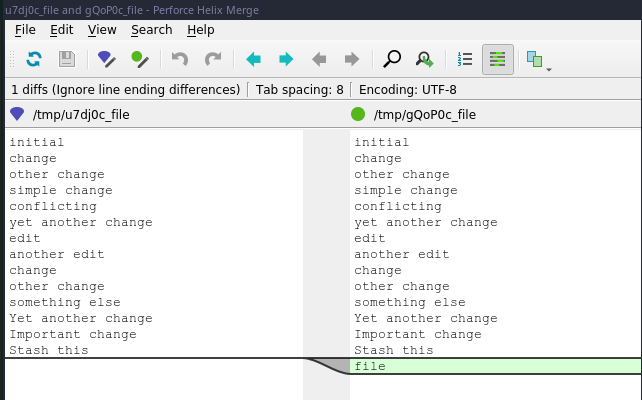

# Comparing tags

```
 master  git status
On branch master
nothing to commit, working tree clean
  master  echo "file" >> file
  master ●  git commit -am "Tweaking a file"
[master 6a09e40] Tweaking a file
 1 file changed, 1 insertion(+)
```

```
git log --oneline --decorate --graph 

* 6a09e40 (HEAD -> master) Tweaking a file
* b4ff9f3 (tag: v-1.0) Done with the WIP2
* 0ce9769 Done with the WIP2
* b419d7e Emergency fix
* c8d946a Done with the WIP
* b8e1096 Quick fix
* ddef7ba (bigtrouble) change after rebase
* 9066d92 fb adding trouble to file
* 0861e5d mb conflicting changes brewing
* 0c5efff mb before rebase conflicts
* 42f5865 Another change
* c671488 feature
* 02064fc edit
*   fa79281 merge conflict
|\  
| * 5d495a8 (conflicting-change) Conflicting change
* | 14ae637 yet another change
|/  
*   620ff72 Mergin changes from simple-change Branch
|\  
| * 83f3159 simple change
* | 19ab207 file2
|/  
*   9521a8d Merge branch 'other-change'
|\  
| * a4d0bc9 Other change
|/  
* 5040750 Change file
* 84f00a8 add file
* 4e4ddba remove file
* e980c5c Add file
* aa6daef moved file
* a6a2066 Yello
* a635aaf initial

git tag -a v-1.1
 master  echo "file change" >> file2
 master ●  git commit -am "Updating for v-1.2"
[master af6b837] Updating for v-1.2
 1 file changed, 1 insertion(+)
 master  git tag -a v-1.2

git tag --list

v-1.0
v-1.1
v-1.2

git log --oneline --decorate --graph

* af6b837 (HEAD -> master, tag: v-1.2) Updating for v-1.2
* 6a09e40 (tag: v-1.1) Tweaking a file
* b4ff9f3 (tag: v-1.0) Done with the WIP2
* 0ce9769 Done with the WIP2
* b419d7e Emergency fix
* c8d946a Done with the WIP
* b8e1096 Quick fix
* ddef7ba (bigtrouble) change after rebase
* 9066d92 fb adding trouble to file
* 0861e5d mb conflicting changes brewing
* 0c5efff mb before rebase conflicts
* 42f5865 Another change
* c671488 feature
* 02064fc edit
*   fa79281 merge conflict
|\  
| * 5d495a8 (conflicting-change) Conflicting change
* | 14ae637 yet another change
|/  
*   620ff72 Mergin changes from simple-change Branch
|\  
| * 83f3159 simple change
* | 19ab207 file2
|/  
*   9521a8d Merge branch 'other-change'
|\  
| * a4d0bc9 Other change
|/  
* 5040750 Change file
* 84f00a8 add file
* 4e4ddba remove file
* e980c5c Add file
* aa6daef moved file
* a6a2066 Yello
* a635aaf initial

git diff v-1.1 v-1.2

diff --git a/file2 b/file2
index 0844032..461fcdc 100644
--- a/file2
+++ b/file2
@@ -2,3 +2,4 @@ file2
 feature
 Some change
 Yet another change
+file change

```

```
git difftool v-1.0 v-1.2
```


