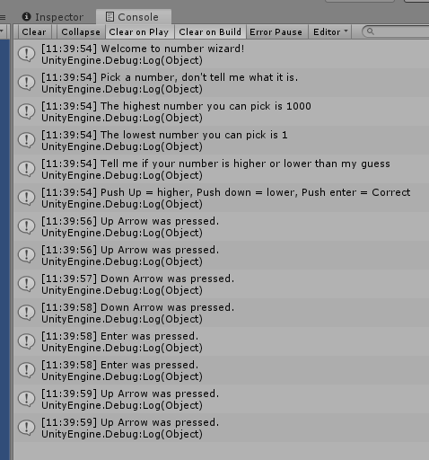

# Respond to player input

We are going to make check for player input to add the ability for the player to indicate whether the guess is higher or lower.

We are going to add some more explanation text and add methods in the update loop to check for key presses.

```csharp
using System.Collections;
using System.Collections.Generic;
using UnityEngine;

public class NumberWizard : MonoBehaviour
{
    int min = 1;
    int max = 1000;

    // Start is called before the first frame update
    void Start()
    {
        Debug.Log("Welcome to number wizard!");
        Debug.Log("Pick a number, don't tell me what it is.");
        Debug.Log("The highest number you can pick is " + max);
        Debug.Log("The lowest number you can pick is " + min);

        Debug.Log("Tell me if your number is higher or lower than my guess");
        Debug.Log("Push Up = higher, Push down = lower, Push enter = Correct");

    }

    // Update is called once per frame
    void Update()
    {

        if ( Input.GetKeyDown(KeyCode.UpArrow) )
        {
            Debug.Log("Up Arrow was pressed.");
        }

        if (Input.GetKeyDown(KeyCode.DownArrow))
        {
            Debug.Log("Down Arrow was pressed.");
        }

        if (Input.GetKeyDown(KeyCode.Return))
        {
            Debug.Log("Enter was pressed.");
        }

    }
}
```

When running, we get this:


