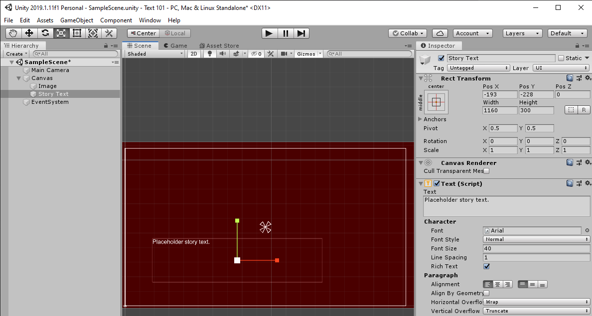
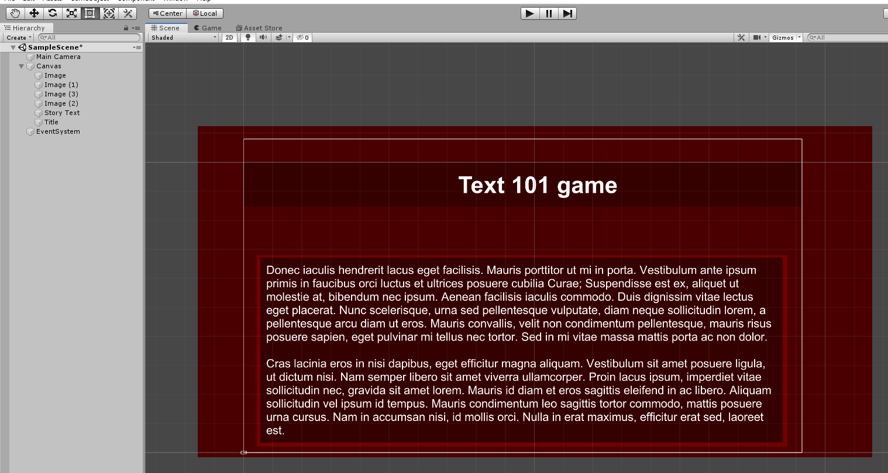

# UI canvas & text

Next we are creating an user interface. That is referring to buttons, text, menus. In unity, the UI lives on the canvas. Canvas is overlayed on top of the game.

We can add a canvas by right clicking on the hierarchy window and going `UI -> Canvas` or following the same path under `GameObject` menu.

It will create two game objects - `Canvas` and `EventSystem`.

Then, when the `Canvas` is selected in the `Hierarchy window`, right click on it and add `UI -> Text`.

Then we add an image in a same manner.

Then, we can change their order, properties etc.

Then we can make more customizations and create something like this:

