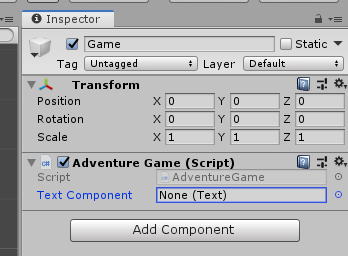
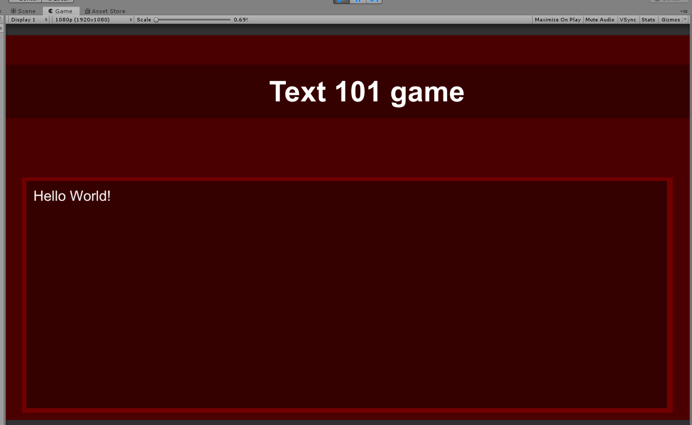

# Update text component

In this section we are going to programmatically add / change text.

First, under `Hierarchy window` we are going right click and select `Create Empty` game object, call it `Game`.

Best practice is also to reset it's coordinates to (0;0;0). Then, while in the `Inspector window`, we can click on `Add component -> New Script` and name it `AdventureGame`, open it in Visual Studio.

We are going to use UI namespace and add text component.

```csharp
using System.Collections;
using System.Collections.Generic;
using UnityEngine;
using UnityEngine.UI;


public class AdventureGame : MonoBehaviour
{

    [SerializeField] Text textComponent;

    // Start is called before the first frame update
    void Start()
    {
        
    }

    // Update is called once per frame
    void Update()
    {
        
    }
}
```

By using the `[SerializeField]`, it will add the field to our inspector.



Then, we can click on the little circle icon and select an element we want to reference. We select `Story Text (text)` element.

```csharp
using System.Collections;
using System.Collections.Generic;
using UnityEngine;
using UnityEngine.UI;


public class AdventureGame : MonoBehaviour
{

    [SerializeField] Text textComponent;

    // Start is called before the first frame update
    void Start()
    {
        textComponent.text = "Hello World!";
    }

    // Update is called once per frame
    void Update()
    {
        
    }
}
```

Now, when we run the game, the text changes:



