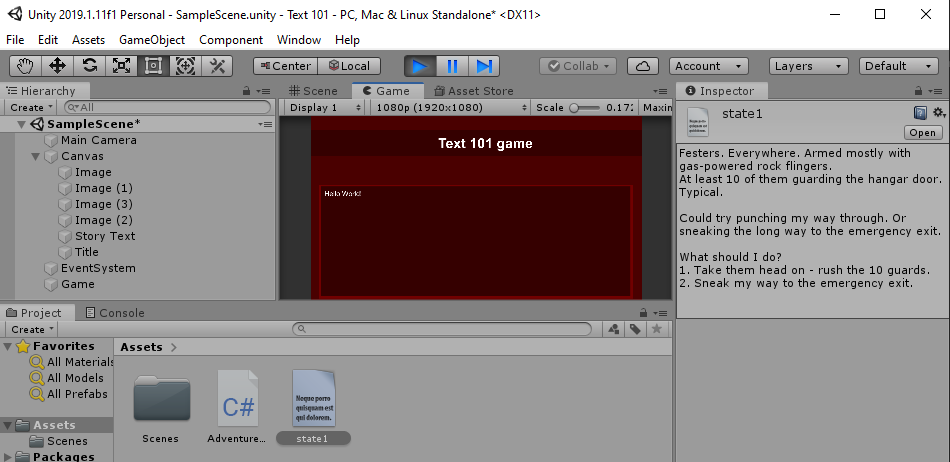

# Game states

When creating a text based game, we will need a lot of text for each situation. In order to do this, we will need a good way organize it. 

We can use a state machine to organize it.

We can create multiple text files with text and save them into our `Assets` directory.

