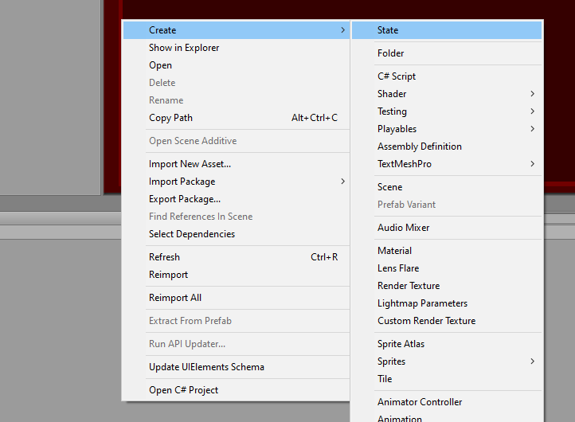
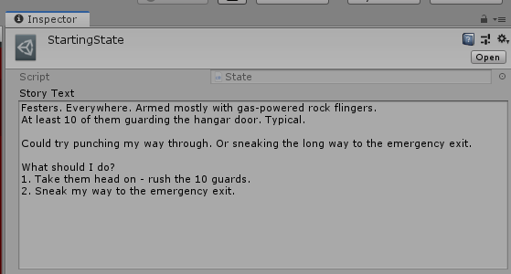

# Scriptable objects

`ScriptableObject` is a class that lets us store data in stand alone assets.

- Keep mountains of data out of our scripts.
- It is lightweight and convenient.
- Used as a template for consistency.

We can use them as a template for the story text.

To create it, we can create a new `C# script` in assets directory and call it `State`.

When opening up in Visual Studio, we change the class inheritance from `MonoBehaviour` to `ScriptableObject`.

```csharp
using System.Collections;
using System.Collections.Generic;
using UnityEngine;

[CreateAssetMenu(menuName = "State")]
public class State : ScriptableObject
{
    [TextArea(14,10)][SerializeField] string storyText;
}
```

Now, when adding new assets, we can choose to add the template `State`.



We create one and call it `StartingState`.
Now we can edit it and insert the text.

