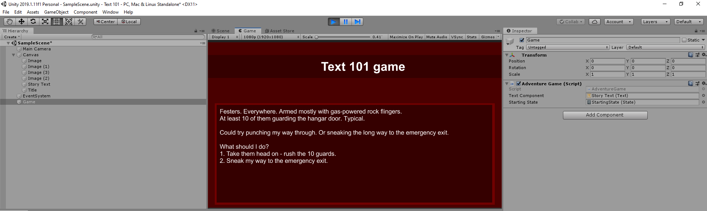

# State Story Implementation

We are going to create a public method in the `State` class we created earlier called `GetStateStory`.

```csharp
using System.Collections;
using System.Collections.Generic;
using UnityEngine;

[CreateAssetMenu(menuName = "State")]
public class State : ScriptableObject
{
    [TextArea(14,10)][SerializeField] string storyText;

    public string GetStateStory()
    {
        return storyText;
    }
}
```

Then we are going to modify the `AdventureGame` class to use these states.

```csharp
using System.Collections;
using System.Collections.Generic;
using UnityEngine;
using UnityEngine.UI;


public class AdventureGame : MonoBehaviour
{

    [SerializeField] Text textComponent;
    [SerializeField] State startingState;
    State state;

    // Start is called before the first frame update
    void Start()
    {
        state = startingState;
        textComponent.text = state.GetStateStory();
    }

    // Update is called once per frame
    void Update()
    {
    }
}
```

Now we can drag in the starting state in the inspector and run the game.

