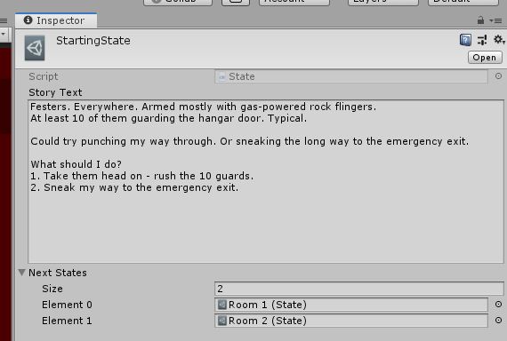

# Creating an array

We can modify the `State` to store a variable to all the next states.

We'll start by creating 2 new states `Room 1` and `Room 2` with a dummy text in them.

Then modify the `State` class to hold a serialized field with an array of states and a method to retrieve it.

```csharp
using System.Collections;
using System.Collections.Generic;
using UnityEngine;

[CreateAssetMenu(menuName = "State")]
public class State : ScriptableObject
{
    [TextArea(14,10)][SerializeField] string storyText;
    [SerializeField] State[] nextStates;

    public string GetStateStory()
    {
        return storyText;
    }

    public State[] GetNextStates()
    {
        return nextStates;
    }
}
```

Now we can add both rooms to the starting state.

