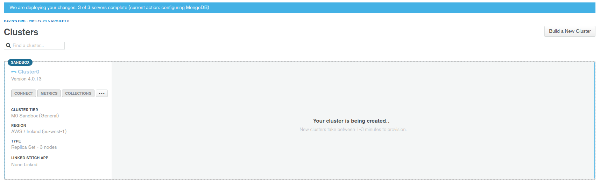
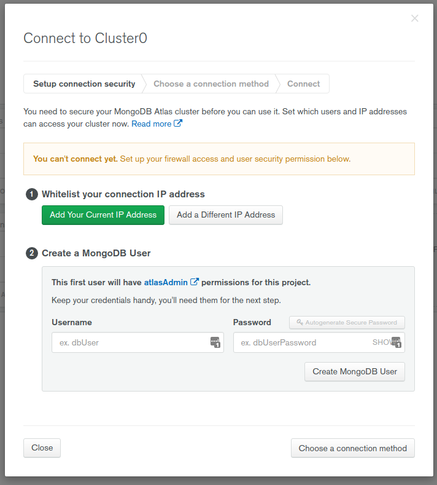

# Connecting to mLab

We can use [mLab](https://mlab.com/) to use as a mongodb service, which is a free service for sandbox mongodb.

We are going to sign up for the service and create a free tier cluster.



Once it's done deploying, we are going to click on `Connect` and create a new user:



Now we are going to install mongoose.

```
➜  server git:(master) ✗ npm i mongoose --save
npm WARN server@1.0.0 No description
npm WARN server@1.0.0 No repository field.

+ mongoose@5.8.2
added 19 packages from 13 contributors and audited 178 packages in 8.253s

1 package is looking for funding
  run `npm fund` for details

found 0 vulnerabilities
```

We're going to install `dotenv` as well, so we don't have to hardcode the credentials.

```
➜  server git:(master) ✗ npm i dotenv --save
npm WARN server@1.0.0 No description
npm WARN server@1.0.0 No repository field.

+ dotenv@8.2.0
added 1 package and audited 179 packages in 0.959s

1 package is looking for funding
  run `npm fund` for details

found 0 vulnerabilities
```

And then we are going to modif the app:

```js
// IMPORTS
const express = require('express');
const graphqlHTTP = require('express-graphql');
const schema = require('./schema/schema');
const mongoose = require('mongoose');
const dotenv = require('dotenv');

// CONSTANTS
dotenv.config();
const app = express();
const APP_PORT= process.env.APP_PORT;
const MONGOOSE_USER = process.env.MONGOOSE_USER;
const MONGOOSE_PASS = process.env.MONGOOSE_PASS;
const MONGOOSE_HOST = process.env.MONGOOSE_HOST;

// LOGIC
mongoose.connect(`mongodb+srv://${MONGOOSE_USER}:${MONGOOSE_PASS}@${MONGOOSE_HOST}?retryWrites=true&w=majority`, {
        useNewUrlParser: true,
        useUnifiedTopology: true
});

mongoose.connection.once('open', () => {
        console.log('connected to database');
});

app.use('/graphql', graphqlHTTP({
        schema
}));

app.listen(APP_PORT, () => console.log(`Listening for requests on port ${APP_PORT}`));
```

If we run the app, we should see that we are connected to the database.

```
➜  server git:(master) ✗ nodemon app.js
[nodemon] 2.0.2
[nodemon] to restart at any time, enter `rs`
[nodemon] watching dir(s): *.*
[nodemon] watching extensions: js,mjs,json
[nodemon] starting `node app.js`
Listening for requests on port 4000
connected to database
```