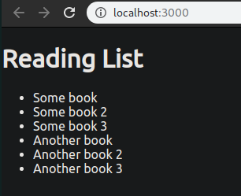

# Making queries from React

We can now modify the `BookList.js` component to query graphql and get a list of books.

## Backend Cross-origin

First, we will construct the query, for that we will need another package in the server.

```
➜  server git:(master) ✗ npm i cors --save                                                                 
npm WARN server@1.0.0 No description
npm WARN server@1.0.0 No repository field.
                                                     
+ cors@2.8.5
added 2 packages from 2 contributors and audited 182 packages in 0.999s

1 package is looking for funding
  run `npm fund` for details

found 0 vulnerabilities
```

And then add it to our app.js

```js
const cors = require('cors');
app.use(cors());
```

This will allow our server to handle cross-origin requests.

## Handling requests from React

We are going to modify the `BookList.js` file to use graphql queries, which will store the result in the props.

```js
import React, { Component } from 'react';                                                    
import { gql } from 'apollo-boost';
import { graphql } from 'react-apollo';                                                      
                                     
const getBooksQuery = gql`                                                                                                   
{
        books {
                name                          
                id                
        }                                     
}                       
`                                                                          
                                                                           
class BookList extends Component {

        displayBooks() {                                                   
                if(this.props.data.loading) {                      
                        return (<div>Loading books...</div>);                                
                }                             
                                     
                return this.props.data.books.map(book => {                                   
                        return (<li key={book.id}>{book.name}</li>)                          
                });     
                                     
        }                                                                  
                                                                           
        render() {                                                         
                return (      
                        <div>
                                <ul id="book-list">                                          
                                        { this.displayBooks() }                              
                                </ul>                                                        
                        </div>                
                )                                                          
        }                

}                                             

export default graphql(getBooksQuery)(BookList);           
```

