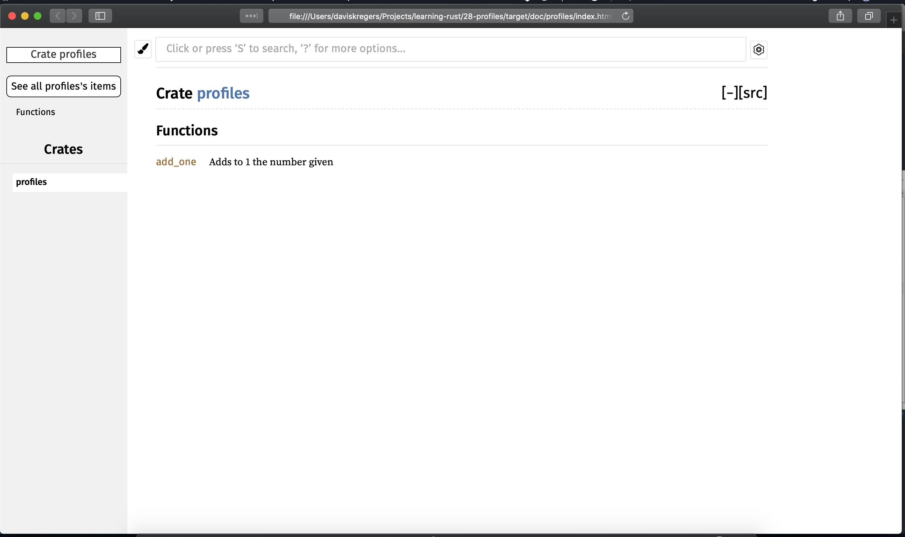
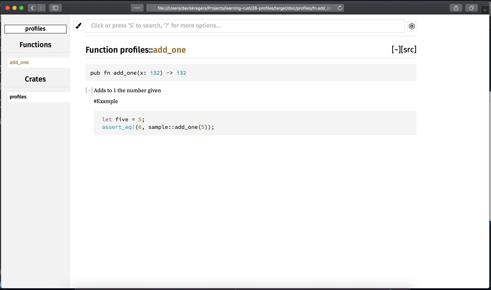

# Cargo and Crates.IO

## Customizing builds with release profiles

There are two cargo profils, a build profile, that is used when we run `cargo build` and release profile when we run `cargo build --release`.

These profiles can be configured in the `Cargo.toml` file:

```
[profile.dev]
opt-level=0

[profile.release]
opt-level=3
```

The `opt-level` stands for optimization level that rust compiler applies on the build. It ranges from 0 to 3, the next level takes more time on the build time, but the run time will be faster.

```zsh
daviskregers@Daviss-MacBook-Pro  ~/Projects/learning-rust/28-profiles   master  cargo build
   Compiling profiles v0.1.0 (/Users/daviskregers/Projects/learning-rust/28-profiles)
    Finished dev [unoptimized + debuginfo] target(s) in 0.64s
```

```zsh
 daviskregers@Daviss-MacBook-Pro  ~/Projects/learning-rust/28-profiles   master  cargo build --release
   Compiling profiles v0.1.0 (/Users/daviskregers/Projects/learning-rust/28-profiles)
    Finished release [optimized] target(s) in 0.31s
```

## Making Documentation

You can document the code using markdown in a following manner:

```rust
///Adds to 1 the number given
///
///#Example
///
///```
/// let five = 5;
/// assert_eq!(6, profiles::add_one(5));
///```
pub fn add_one(x:i32) -> i32 {
    x + 1
}
```

The documentation can be build using a command:

```
cargo doc
```

The documentation can be opened using

```
cargo doc --open
```




The `Examples` part is also running as a `doctest`:

```
cargo test
```


## Publishing to Crate.IO

First, you need to create an account on [https://crates.io/](https://crates.io/) and obtain an API key.

```
cargo login API_KEY
```

Now, you will need to modify the `Cargo.toml` file and add `description` and `license`:

```
description = "This is a description"
license = "MIT"
```

Now, you can publish it with

```
cargo publish
```

## Cargo Workspaces

You can create a directory with a `Cargo.toml` file in it:

```toml
[workspace]
members=[
    "adder",
    "add-one"
]
```

```
cargo new adder
cargo new add-one --lib
```

in the `adder/Cargo.toml`:

```
[dependencies]
add-one={path="../add-one"}
```

In `add-one/src/lib.rs`:

```rust
pub fn add_one(num : i32) -> i32 {
    num + 1
}
```

In `adder/src/main.rs`:

```rust
extern crate add_one;
fn main() {
    let num = 10;
    println!("{}", add_one::add_one(num));
}
```

```
cargo build
```

```
✘ daviskregers@Daviss-MacBook-Pro  ~/Projects/learning-rust/28-workspaces   master  cargo build
   Compiling add-one v0.1.0 (/Users/daviskregers/Projects/learning-rust/28-workspaces/add-one)
   Compiling adder v0.1.0 (/Users/daviskregers/Projects/learning-rust/28-workspaces/adder)
    Finished dev [unoptimized + debuginfo] target(s) in 0.67s
```

```
cargo run
```

```
daviskregers@Daviss-MacBook-Pro  ~/Projects/learning-rust/28-workspaces   master  cargo run
    Finished dev [unoptimized + debuginfo] target(s) in 0.05s
     Running `target/debug/adder`
11
```

You can then add tests in the same manner before:

```rust
#[cfg(test)]
mod tests {
    use super::*;
    #[test]
    fn it_works() {
        assert_eq!(4, add_one(3));
        assert_eq!(6, add_one(5));
    }
}
```

```
cargo test
```

```
✘ daviskregers@Daviss-MacBook-Pro  ~/Projects/learning-rust/28-workspaces   master  cargo test
   Compiling add-one v0.1.0 (/Users/daviskregers/Projects/learning-rust/28-workspaces/add-one)
   Compiling adder v0.1.0 (/Users/daviskregers/Projects/learning-rust/28-workspaces/adder)
    Finished dev [unoptimized + debuginfo] target(s) in 0.74s
     Running target/debug/deps/add_one-04932d8ef5f0255b

running 1 test
test tests::it_works ... ok

test result: ok. 1 passed; 0 failed; 0 ignored; 0 measured; 0 filtered out

     Running target/debug/deps/adder-0285b0883f304ad9

running 0 tests

test result: ok. 0 passed; 0 failed; 0 ignored; 0 measured; 0 filtered out

   Doc-tests add-one

running 0 tests

test result: ok. 0 passed; 0 failed; 0 ignored; 0 measured; 0 filtered out
```

### Installing binaries from Cargo.IO

```
cargo install package
```

